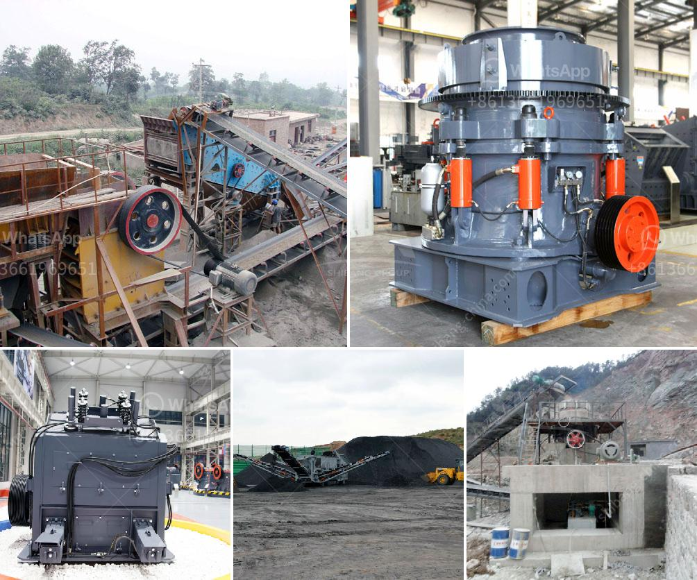

<h3>large gravel powder machine</h3>
In the world of construction and infrastructure development, gravel plays a crucial role in creating a strong foundation for various projects. However, managing and processing large quantities of gravel can be a challenging task. This is where large gravel powder machines come into the picture, revolutionizing the gravel processing industry. With their advanced features and capabilities, these machines have become an indispensable asset for many construction companies.

Large gravel powder machines are designed to efficiently crush and grind the raw gravel into fine powder, catering to the diverse needs of the construction industry. These powerful machines are equipped with high-speed rotating blades and hammers, which break down the gravel into smaller particles. Consequently, the gravel becomes easier to handle and transport, significantly reducing both labor and time requirements.

The versatility of large gravel powder machines knows no bounds, as they can process different types of gravel to meet specific project requirements. Whether it is limestone, granite, or sandstone, these machines can effectively convert them into powder, making it easier for construction companies to utilize gravel as per their needs. This flexibility has led to a substantial increase in the utilization of gravel in various construction projects, preventing wastage and enhancing sustainability.

Investing in a large gravel powder machine can result in long-term cost savings for construction firms. By efficiently processing gravel, these machines eliminate the need to purchase expensive gravel powders from external suppliers. Moreover, the reduction in manual labor involved in manually crushing and grinding the gravel also leads to significant cost savings. Construction companies can channel these saved finances towards other critical aspects of the project, ultimately enhancing their overall profitability.

Large gravel powder machines play a vital role in ensuring consistent and high-quality gravel powder production. These machines are equipped with advanced technology that allows for precise control over the crushing and grinding process. As a result, the size and texture of the powdered gravel can be fine-tuned to meet the exact specifications required for a particular construction project. Consistency in gravel powder quality not only enhances the overall aesthetics but also ensures long-lasting structural stability.

Gravel powder machines are designed to minimize dust and noise pollution, establishing them as environmentally friendly solutions. These machines feature advanced dust extraction mechanisms, preventing the dispersion of harmful particles and promoting a cleaner working environment. Additionally, their low noise emissions contribute to preserving the tranquility of surrounding areas, making them suitable for both urban and rural construction projects.

The adoption of large gravel powder machines has revolutionized the construction industry by streamlining gravel processing operations. These powerful machines offer enhanced efficiency, cost savings, versatility, and improved quality, proving their worth in countless construction projects worldwide. As the demand for infrastructure development continues to rise, large gravel powder machines will play a vital role in ensuring the creation of strong foundations and structures.
<h3>Contact us</h3><ul><li><strong>Whatsapp:&nbsp;<a href="https://wa.me/8613661969651">+8613661969651</a></strong></li><li><a href="https://swt.shibang-china.com/?git&amp;zhl&amp;large gravel powder machine"><strong>Online Service(chat now)</strong></a></li></ul><h3>Related</h3><ul><li><a href='100tpd crusher plant.md'>100tpd crusher plant</a></li><li><a href='quarry business in nigeria.md'>quarry business in nigeria</a></li><li><a href='hammer mills hammer mills.md'>hammer mills hammer mills</a></li><li><a href='plant project report pdf stone crushing.md'>plant project report pdf stone crushing</a></li><li><a href='rental of crusher in malaysia.md'>rental of crusher in malaysia</a></li></ul>