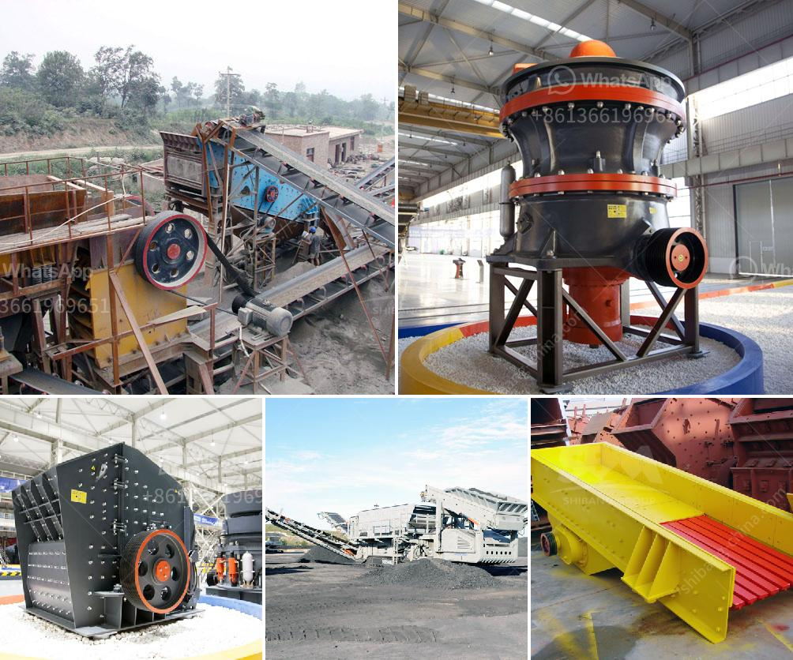

<h3>large size stone crusher price</h3>
The large size stone crusher is mainly used for the crushing of large stones or rocks with high hardness and large size, such as river pebbles, granite, basalt, limestone, quartz, coal gangue, coal, slag, etc. Due to its wide application range and high production efficiency, it is favored by users.

When purchasing large size stone crushers, the price is undoubtedly one of the most important factors. However, the price of large size stone crushers is affected by various factors, such as equipment quality, market demand, manufacturer strength, after-sales service, etc. Therefore, it is necessary to consider these factors comprehensively when choosing equipment, rather than blindly pursuing low prices.

First, the quality of large size stone crushers directly affects the production efficiency and service life of the equipment. It is recommended to choose well-known and reliable manufacturers to ensure the quality of the equipment. The quality of the equipment can be judged from the aspects of material selection, workmanship, and production process. High-quality large size stone crushers are usually made of high-quality materials and have advanced processing technology, which can effectively ensure the stability of equipment operation and reduce the failure rate.

Second, market demand is another factor that affects the price of large size stone crushers. When the supply exceeds the demand, the price of the equipment may be relatively low. Conversely, when the demand exceeds the supply, the price may be relatively high. Therefore, it is necessary to understand the market demand and choose an appropriate purchasing time to obtain a more favorable price.

Additionally, the strength of the manufacturer and after-sales service should also be considered. Strong manufacturers often have advanced technology, comprehensive services, and more professional technical support, which can provide users with better equipment and services. Meanwhile, reliable after-sales service can effectively solve various problems encountered during the use of large size stone crushers and reduce unnecessary losses.

In conclusion, when purchasing large size stone crushers, the price should be considered comprehensively, including equipment quality, market demand, manufacturer strength, and after-sales service. It is recommended to choose high-quality equipment from well-known manufacturers with good after-sales service, which can not only ensure the smooth operation of the equipment but also save costs in the long run.
<h3>Contact us</h3><ul><li><strong>Whatsapp:&nbsp;<a href="https://wa.me/8613661969651">+8613661969651</a></strong></li><li><a href="https://swt.shibang-china.com/?git&amp;zhl&amp;large size stone crusher price"><strong>Online Service(chat now)</strong></a></li></ul><h3>Related</h3><ul><li><a href='how to start a quarry business in nigeria.md'>how to start a quarry business in nigeria</a></li><li><a href='japan used mine equipment price.md'>japan used mine equipment price</a></li><li><a href='vibration ranges for jaw crusher.md'>vibration ranges for jaw crusher</a></li><li><a href='conveyor belt manufacturer in uae.md'>conveyor belt manufacturer in uae</a></li><li><a href='mobile crusher specification.md'>mobile crusher specification</a></li></ul>