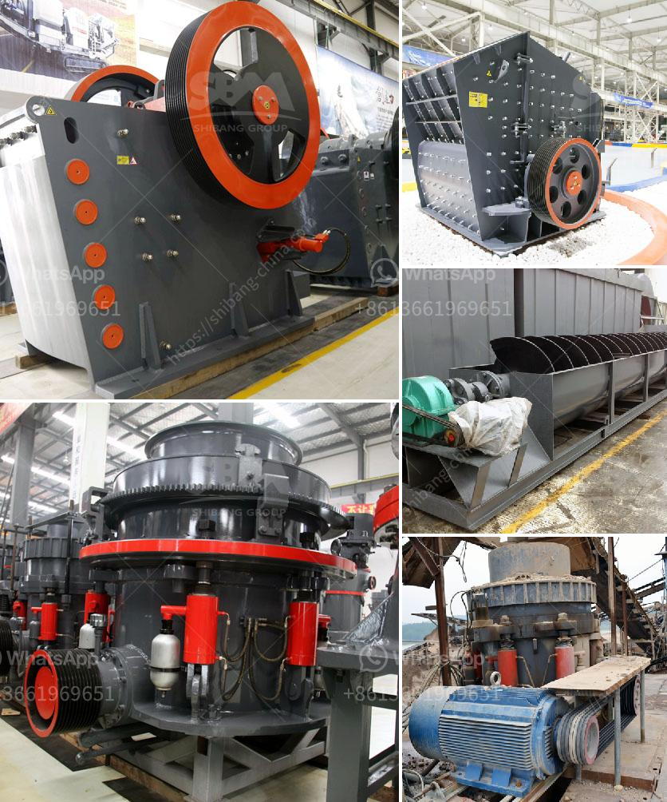

<h3>large volume conveyor belt systems rentals</h3>
Large volume conveyor belt systems rentals provide a practical solution for businesses that have temporary or seasonal needs for transporting materials efficiently and cost-effectively. These systems consist of a series of conveyor belts that are seamlessly connected to form a continuous flow of goods, allowing for smooth and rapid movement from one location to another.

One of the key advantages of renting large volume conveyor belt systems is the flexibility it offers. Businesses can easily scale up or down their operations based on demand without the hassle of investing in a permanent infrastructure. This is particularly beneficial for industries such as construction, mining, agriculture, and warehousing that experience varying volumes of materials to be transported.

Moreover, renting conveyor belt systems eliminates the burden of maintenance and repair costs, as these responsibilities typically fall on the rental company. Companies can focus on their core operations and rely on the expertise of the rental provider to ensure the smooth operation of the conveyor system.

Another notable advantage is the cost-effectiveness of renting these systems. The initial capital investment required to purchase conveyor belts can be significant, especially for businesses with limited budgets. Renting, on the other hand, allows companies to access the necessary equipment without a substantial upfront investment. Additionally, rental agreements often include flexible terms and pricing options that can align with the specific needs and budget of the business.

Large volume conveyor belt systems rentals also provide the benefit of customization. Businesses can consult with the rental provider to tailor the system to their specific requirements, including length, speed, and load capacity. This ensures that the conveyor system meets the unique demands of the industry and maximizes efficiency.

In conclusion, large volume conveyor belt system rentals offer a convenient, cost-effective, and flexible solution for businesses that require temporary or seasonal transportation of materials. By eliminating the need for a permanent infrastructure and maintenance costs, and providing customizable options, renting conveyor systems allows businesses to focus on their core operations and adapt to changing needs seamlessly.
<h3>Contact us</h3><ul><li><strong>Whatsapp:&nbsp;<a href="https://wa.me/8613661969651">+8613661969651</a></strong></li><li><a href="https://swt.shibang-china.com/?git&amp;zhl&amp;large volume conveyor belt systems rentals"><strong>Online Service(chat now)</strong></a></li></ul><h3>Related</h3><ul><li><a href='china clay grinding machine.md'>china clay grinding machine</a></li><li><a href='track mounted jaw crusher.md'>track mounted jaw crusher</a></li><li><a href='3 roll mill specifications.md'>3 roll mill specifications</a></li><li><a href='barite powder mill in india.md'>barite powder mill in india</a></li><li><a href='bimach grinding marble.md'>bimach grinding marble</a></li></ul>