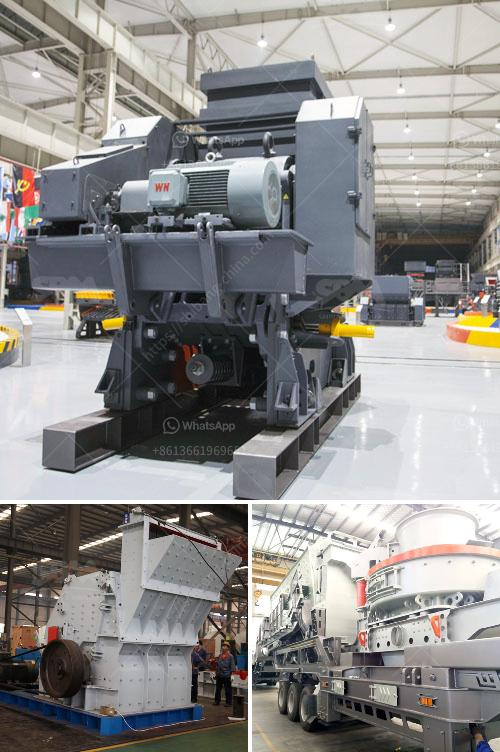

<h3>lavadora de arena en mexico</h3>
La lavadora de arena es una máquina imprescindible en la industria de la construcción, especialmente en un país como México que posee una amplia costa y una gran demanda de materiales para la edificación. Este equipo ofrece una solución efectiva para la limpieza y clasificación de los agregados utilizados en la construcción, permitiendo producir arena de alta calidad.

La lavadora de arena en México se utiliza principalmente en la extracción de arena para obras de construcción, así como en la producción de áridos para el hormigón y otros materiales de construcción. Su función principal es eliminar los sedimentos y las impurezas de la arena, dejándola en las condiciones ideales para su uso en diversos proyectos de construcción.

Este equipo trabaja utilizando un sistema de limpieza por turbulencia, impulsando el agua a alta presión en el tanque de lavado junto con la arena. A medida que el agua agita y remueve las impurezas, las partículas más livianas son arrastradas y desechadas, mientras que la arena limpia y clasificada es conducida a través de una espiral hacia la parte superior de la máquina.

En México, el uso de la lavadora de arena ha aumentado considerablemente en los últimos años debido al crecimiento de la industria de la construcción y la demanda de materiales de alta calidad. Además, la lavadora de arena en México se caracteriza por ser eficiente energéticamente, lo que la convierte en una opción favorable para las empresas del sector.

Asimismo, cabe destacar que la lavadora de arena proporciona importantes beneficios, como la reducción de los costos y el tiempo de producción al obtener materiales de calidad listos para su utilización. Además, contribuye a la preservación del medio ambiente al permitir la reutilización del agua utilizada en el proceso de lavado.

En conclusión, la lavadora de arena es un componente esencial en la industria de la construcción en México. Gracias a su capacidad para limpiar y clasificar la arena utilizada en diversas obras, se ha convertido en un equipo imprescindible para garantizar la calidad de los materiales utilizados en la edificación. Su eficiencia y beneficios económicos y ambientales la han posicionado como una herramienta clave para las empresas constructoras en México.
<h3>Contact us</h3><ul><li><strong>Whatsapp:&nbsp;<a href="https://wa.me/8613661969651">+8613661969651</a></strong></li><li><a href="https://swt.shibang-china.com/?git&amp;zhl&amp;lavadora de arena en mexico"><strong>Online Service(chat now)</strong></a></li></ul><h3>Related</h3><ul><li><a href='stamler usa feeder breaker crusher.md'>stamler usa feeder breaker crusher</a></li><li><a href='mantencion a cone crusher.md'>mantencion a cone crusher</a></li><li><a href='cost of gold bow mill for sale in south africa.md'>cost of gold bow mill for sale in south africa</a></li><li><a href='grinding mills supplier in gujraanwala.md'>grinding mills supplier in gujraanwala</a></li><li><a href='feldspar grinding in raymond mill.md'>feldspar grinding in raymond mill</a></li></ul>