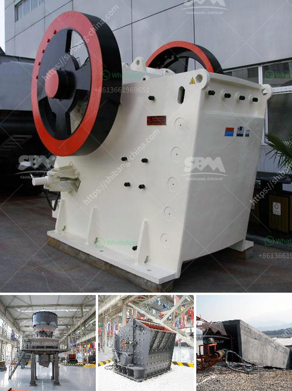

<h3>layoutde a crusher machine</h3>
Crusher machines are essential equipment in mining and construction industries. In quarrying and mining, it is used to break down large rocks into smaller pieces for further processing. Crushing machines come in various sizes and types, each designed to handle different materials and capacities. When designing a crusher machine, the layout plays a crucial role in ensuring efficient operation and maximum productivity.

The first step in designing a crusher machine is to determine the desired output size of the material. This will help determine the type and size of the machine needed. Once the machine type is decided, the layout design comes into play. The layout design involves arranging the various components of the machine in an optimal way, ensuring smooth flow of materials and ease of maintenance.

One important consideration in layout design is the feed arrangement. The material should be fed into the machine uniformly to prevent uneven wear on the crushing surfaces. A vibrating feeder or a conveyor belt can be used to achieve this. The location of the feed arrangement should be such that it minimizes the distance between the feeding point and the crushing chamber, reducing the risk of material segregation.

The crusher itself should be positioned in a way that facilitates easy access for maintenance and repairs. A clear pathway should be provided for operators to inspect and clean the machine. Additionally, safety considerations should be taken into account, ensuring proper guarding and warning signs are in place to prevent accidents.

Moreover, the layout should consider the size and shape of the processing area. Sufficient space should be allotted for feeding and discharging of materials, as well as for the movement of operators and maintenance personnel. This will enhance the efficiency of the overall operation and reduce the chances of bottlenecks or safety hazards.

In conclusion, a well-designed layout is crucial when designing a crusher machine. It impacts the efficiency, productivity, and safety of the operation. Considerations such as feed arrangement, access for maintenance, and space allocation should be taken into account. By carefully planning the layout, one can optimize the performance of the crusher machine and ensure smooth operations for years to come.
<h3>Contact us</h3><ul><li><strong>Whatsapp:&nbsp;<a href="https://wa.me/8613661969651">+8613661969651</a></strong></li><li><a href="https://swt.shibang-china.com/?git&amp;zhl&amp;layoutde a crusher machine"><strong>Online Service(chat now)</strong></a></li></ul><h3>Related</h3><ul><li><a href='100tpd crusher plant.md'>100tpd crusher plant</a></li><li><a href='stone quarrys crusher in ghana.md'>stone quarrys crusher in ghana</a></li><li><a href='the world largest mobile crusher.md'>the world largest mobile crusher</a></li><li><a href='stone crusher plant ton per hour.md'>stone crusher plant ton per hour</a></li><li><a href='double toggle jaw crusher.md'>double toggle jaw crusher</a></li></ul>