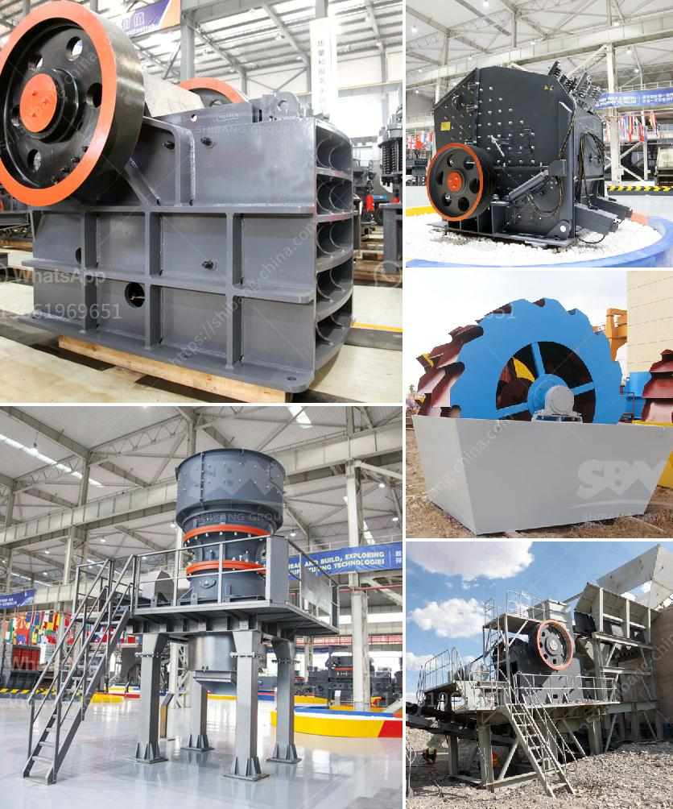

<h3>lime powder marking machines</h3>
Lime powder marking machines have become increasingly popular in the construction and road marking industries due to their efficiency and precision in producing vibrant and durable lines. These machines utilize a lime powder-based paint that is known for its longevity and visibility, making it the ideal choice for various applications.

One of the key advantages of lime powder marking machines is their ability to create clear and distinct lines. The powdered lime paint used in these machines provides exceptional visibility, even in low-light conditions. This is particularly advantageous in road marking projects where visibility is crucial for drivers, ensuring safety on the roads.

Furthermore, lime powder marking machines offer remarkable durability. The lime powder-based paint adheres strongly to surfaces, making it resistant to wear and tear caused by traffic, weather conditions, and other external factors. This longevity significantly reduces the frequency of line repainting, saving both time and resources in the long run.

Another noteworthy aspect of lime powder marking machines is their efficiency. These machines are designed to optimize productivity, allowing for quick and precise line marking. With their streamlined operations, they ensure that construction and road marking projects are completed within the scheduled timeframe. This efficiency is particularly essential when dealing with time-sensitive projects.

In addition to efficiency, lime powder marking machines also boast user-friendly features. Most machines are equipped with adjustable spray nozzles that allow operators to customize the width and thickness of the lines according to project requirements. Additionally, the machines are generally compact and easy to maneuver, enabling seamless operation in various settings.

Furthermore, lime powder marking machines are considered environmentally-friendly. The lime powder-based paint used in these machines is non-toxic, biodegradable, and does not emit harmful gases, making it a safe choice for both operators and the environment. Additionally, these machines have low noise levels, minimizing noise pollution in residential areas.

It is important to note that lime powder marking machines do require regular maintenance. Proper cleaning and upkeep of the machines' components, such as spray nozzles and filters, are necessary to ensure consistent performance and longevity. However, with regular maintenance, these machines can provide years of reliable service.

In conclusion, lime powder marking machines offer numerous advantages in terms of visibility, durability, efficiency, and environmental-friendliness. Their ability to produce clear and long-lasting lines make them ideal for a variety of applications, including road markings, parking lots, and construction sites. These machines enable precise line marking, streamline operations, and minimize the need for frequent repainting. With their user-friendly features and environmentally-conscious attributes, lime powder marking machines have become an indispensable tool in the construction and road marking industries.
<h3>Contact us</h3><ul><li><strong>Whatsapp:&nbsp;<a href="https://wa.me/8613661969651">+8613661969651</a></strong></li><li><a href="https://swt.shibang-china.com/?git&amp;zhl&amp;lime powder marking machines"><strong>Online Service(chat now)</strong></a></li></ul><h3>Related</h3><ul><li><a href='stone crusher coalaries.md'>stone crusher coalaries</a></li><li><a href='sand powder milling machine.md'>sand powder milling machine</a></li><li><a href='aggregate conveyor systems.md'>aggregate conveyor systems</a></li><li><a href='crusher plant dealer in pakistan.md'>crusher plant dealer in pakistan</a></li><li><a href='top ten cement plant epc contractor.md'>top ten cement plant epc contractor</a></li></ul>