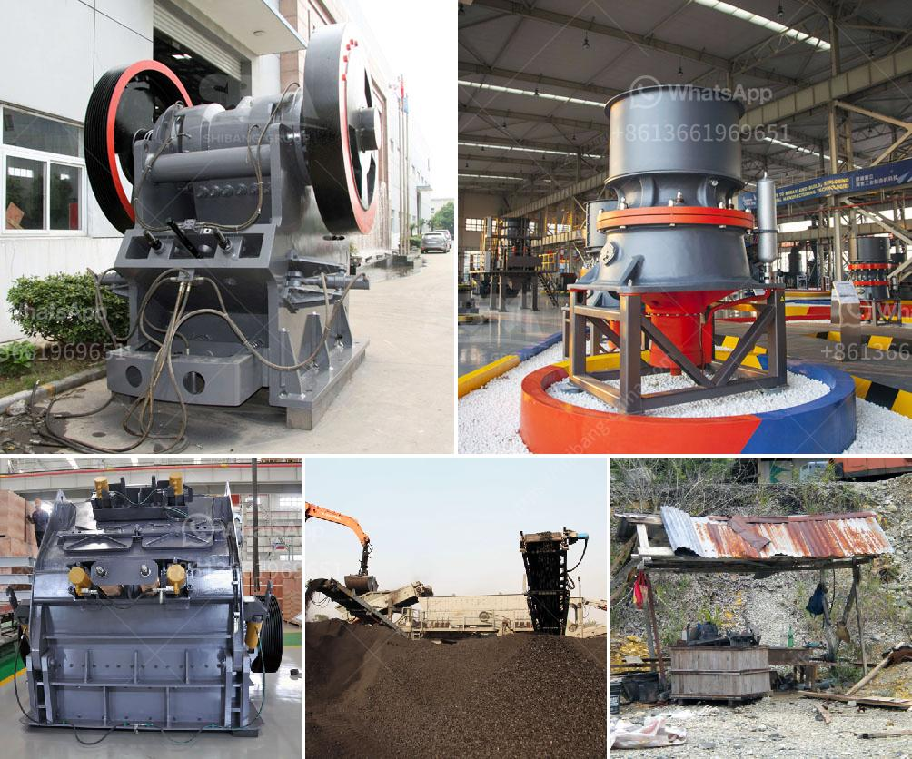

<h3>lime powder suppliers in patna</h3>
Patna, the capital city of Bihar, has been experiencing rapid economic growth and urbanization in recent years. With the government's emphasis on infrastructure development and the increasing demand for construction projects, the need for lime powder suppliers in Patna has also seen a significant rise. Lime powder, also known as hydrated lime or calcium hydroxide, plays a crucial role in the construction industry due to its versatility and various beneficial properties.

Lime powder is a widely used material in construction, mainly for its binding and adhesive properties. It acts as a mortar component, providing strength and stability to building structures. Additionally, lime powder is an important ingredient in plastering and rendering processes, contributing to the smoothness and durability of walls. It can also be used as a soil stabilizer and in the manufacturing of concrete and asphalt.

In Patna, there are numerous lime powder suppliers catering to the booming construction industry. These suppliers source the lime powder from different regions, ensuring the availability of high-quality products for their customers. The lime powder suppliers in Patna maintain a diverse range of products to meet the varying requirements of builders, contractors, and individuals involved in the construction sector.

The suppliers in Patna procure lime powder from renowned manufacturers who adhere to stringent quality control measures. The lime powder undergoes rigorous testing to meet the industry standards and to ensure that it possesses the desired chemical composition and physical properties. This ensures that the end-users receive lime powder of superior quality, enabling them to produce strong and durable structures.

One of the key advantages of sourcing lime powder from local suppliers in Patna is the availability and timely delivery. These suppliers have well-established distribution networks, enabling them to quickly respond to customer demands. They have extensive knowledge of the local construction market, allowing them to provide tailored solutions and recommendations for specific project requirements.

Furthermore, lime powder suppliers in Patna offer competitive pricing to their customers. As they have a deep understanding of the local market dynamics, they can provide cost-effective solutions without compromising the quality of their products. This makes lime powder an affordable choice for construction projects in Patna, attracting further investment opportunities in the region.

Lastly, lime powder suppliers in Patna prioritize customer satisfaction and aim to build long-term relationships with their clients. They provide excellent after-sales service, addressing any issues or concerns that may arise during the construction process. Whether it is technical support or assisting with quantity estimations, these suppliers are committed to delivering a seamless experience to their customers.

In conclusion, the surge in construction activities in Patna has fueled the demand for lime powder suppliers. These suppliers play a crucial role in the construction industry by providing high-quality lime powder for various construction needs. With their extensive product range, competitive pricing, and commitment to customer satisfaction, lime powder suppliers in Patna remain a vital link in the construction boom of the city.
<h3>Contact us</h3><ul><li><strong>Whatsapp:&nbsp;<a href="https://wa.me/8613661969651">+8613661969651</a></strong></li><li><a href="https://swt.shibang-china.com/?git&amp;zhl&amp;lime powder suppliers in patna"><strong>Online Service(chat now)</strong></a></li></ul><h3>Related</h3><ul><li><a href='ball mills for calcium.md'>ball mills for calcium</a></li><li><a href='fine grinding mill.md'>fine grinding mill</a></li><li><a href='small grinding machine for limestone.md'>small grinding machine for limestone</a></li><li><a href='diamond mining plant layout.md'>diamond mining plant layout</a></li><li><a href='raymond mill manufacturer.md'>raymond mill manufacturer</a></li></ul>