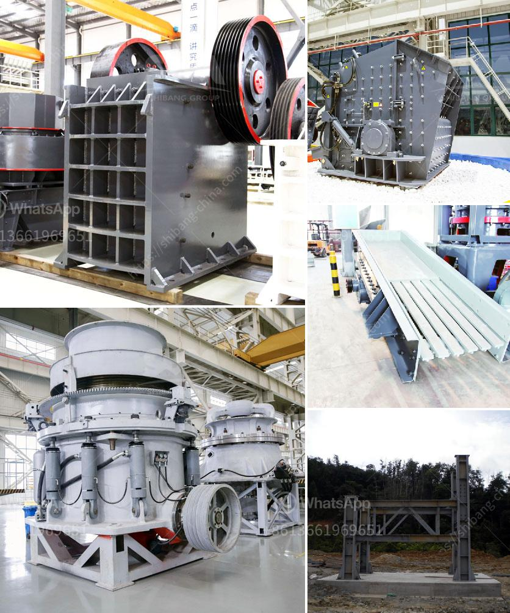

<h3>lime stone extraction equipment india</h3>
Limestone is a sedimentary rock composed mainly of calcium carbonate (CaCO3). It is extracted from natural limestone deposits, making it an abundant and affordable source of raw material for various industries. The process of extracting limestone requires specialized equipment and machinery, which we will discuss in this article.

India is home to numerous limestone reserves, which are found in various states such as Madhya Pradesh, Rajasthan, Andhra Pradesh, Gujarat, and Chhattisgarh. These limestone deposits provide a wealth of opportunities for the country's construction, cement, steel, and chemical industries.

To extract limestone, the raw material must be first blasted or drilled from the earth’s crust. This process is called quarrying. Depending on the scale of the operation, various extraction methods such as open-pit mining, underground mining, or hybrid methods can be employed.

In open-pit mining, huge earth-moving equipment, such as excavators and bulldozers, are utilized to extract and load the limestone into haul trucks. The equipment must be capable of digging, transporting, and dumping the limestone in a continuous and efficient manner. Some of the commonly used equipment in open-pit mining includes drill rigs, rock crushers, shovels, loaders, and haul trucks.

On the other hand, underground mining involves tunnelling into the earth to extract the limestone deposits. This method typically requires more specialized machinery due to the confined space and potential hazards involved. Equipment such as underground loaders, roof bolters, and longwall shearers may be used for excavation and extraction.

Apart from extraction, limestone also needs to be processed before it can be used in various applications. Crushing and screening equipment play a crucial role in this process. Primary crushers, secondary crushers, and screens are used to reduce the size of limestone rocks and separate them into various sizes for further processing. These crushers and screens need to be durable, efficient, and capable of handling large volumes of material.

Once the limestone has been extracted and processed, it can be used in a variety of ways. In the cement industry, limestone is a key ingredient in the production of cement, acting as a binding agent when mixed with other materials. It is also used as a fluxing agent in the steel industry to remove impurities during the production of steel. Additionally, limestone is used in the manufacturing of glass, fertilizer, and various chemical products.

In India, several companies specialize in the manufacturing and supplying of limestone extraction and processing equipment. These companies provide a range of machinery suited to different scales of operations, from small-scale quarries to large mining projects. Some of the popular manufacturers and suppliers in India include TIL Limited, Sandvik, Metso, Epiroc, and Caterpillar.

In conclusion, limestone extraction equipment plays a vital role in the quarrying and mining industry in India. The machinery must be reliable, efficient, and capable of handling large volumes of limestone. With the abundant limestone reserves in the country, these equipment providers are crucial for meeting the demands of various industries such as construction, cement, steel, and chemical. Continuous advancements in technology ensure that the extraction process is carried out safely and sustainably, with minimal impact on the environment.
<h3>Contact us</h3><ul><li><strong>Whatsapp:&nbsp;<a href="https://wa.me/8613661969651">+8613661969651</a></strong></li><li><a href="https://swt.shibang-china.com/?git&amp;zhl&amp;lime stone extraction equipment india"><strong>Online Service(chat now)</strong></a></li></ul><h3>Related</h3><ul><li><a href='used vertical roller mill for sale.md'>used vertical roller mill for sale</a></li><li><a href='stone crusher design philippines.md'>stone crusher design philippines</a></li><li><a href='ghana quarry crusher.md'>ghana quarry crusher</a></li><li><a href='ball mill in kazakhstan.md'>ball mill in kazakhstan</a></li><li><a href='hammer mills hammer mills.md'>hammer mills hammer mills</a></li></ul>