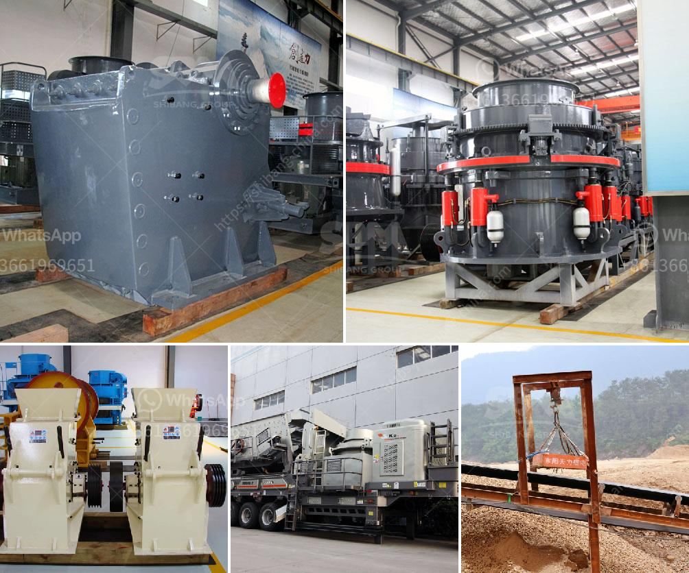

<h3>limestone ball mill</h3>
Limestone is a common rock that is widely used in various industries. It is primarily composed of calcium carbonate, which is the main component of marine organisms such as shells, pearls, and the skeletons of coral reefs. Limestone is extracted from quarries or mines and then crushed into a fine powder for use in various applications.

One of the most common uses of limestone is in the construction industry, where it is used as a building material. Limestone has excellent durability and can withstand various weather conditions, making it ideal for buildings, bridges, and other structures. It is also used as a raw material in the production of cement, which is a key ingredient in concrete.

In order to process limestone into a usable form, limestone ball mills are used. A limestone ball mill is a versatile grinding mill commonly used for producing powders in the mineral processing industry. This type of mill has a cylindrical shell with a diameter of up to six meters, providing a large grinding surface area compared to traditional mills.

The limestone is fed into the mill through a throat feeder, where it is mixed with water to form a slurry. This slurry is then pumped into the mill's grinding chamber, where it is subjected to the grinding media, which can be steel balls or ceramic beads. The grinding media crush, grind, or disperse the limestone particles, resulting in a fine powder.

The main advantages of using a limestone ball mill are its low energy consumption and high grinding efficiency. The energy consumption of limestone ball mills is significantly lower compared to other grinding mills, such as vertical roller mills and Raymond mills. This is mainly due to the relatively low hardness and brittleness of limestone, which requires less energy to grind.

Additionally, limestone ball mills are also known for their high grinding efficiency. The large grinding surface area provided by the cylindrical shell allows for a greater number of collisions between the grinding media and the limestone particles, resulting in faster and more efficient grinding. This leads to a higher production rate and better quality of the final product.

Furthermore, limestone ball mills are easy to operate and maintain. They have a simple and robust design, making them suitable for both continuous and batch grinding operations. The mills are also equipped with various safety measures to ensure the protection of the operators and the equipment.

In conclusion, limestone ball mills are essential equipment in the mineral processing industry for grinding limestone into a fine powder. They offer several advantages, including low energy consumption, high grinding efficiency, and ease of operation and maintenance. As the demand for limestone continues to grow, the importance of limestone ball mills is expected to increase, and manufacturers are constantly improving the design and efficiency of these mills to meet the industry's needs.
<h3>Contact us</h3><ul><li><strong>Whatsapp:&nbsp;<a href="https://wa.me/8613661969651">+8613661969651</a></strong></li><li><a href="https://swt.shibang-china.com/?git&amp;zhl&amp;limestone ball mill"><strong>Online Service(chat now)</strong></a></li></ul><h3>Related</h3><ul><li><a href='business plan for small scale chrome mining.md'>business plan for small scale chrome mining</a></li><li><a href='equipment to start up a quarry crusher.md'>equipment to start up a quarry crusher</a></li><li><a href='xzm series ultra fine mill zenith.md'>xzm series ultra fine mill zenith</a></li><li><a href='barite processing plant.md'>barite processing plant</a></li><li><a href='how to build a hammer mill.md'>how to build a hammer mill</a></li></ul>