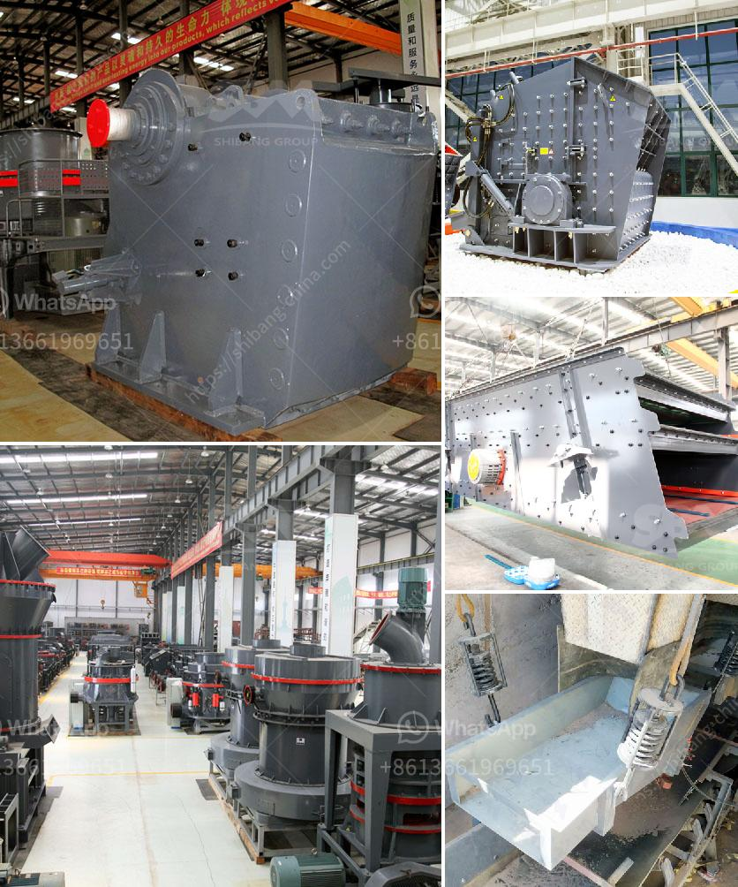

<h3>limestone calcium hydroxide machine</h3>
Limestone is a widely-used natural resource known for its versatility and strength. It is primarily used in the construction industry for creating building materials and as a key ingredient in cement production. One of the most innovative advancements in the limestone industry is the limestone calcium hydroxide machine.

The limestone calcium hydroxide machine is a cutting-edge technology that is revolutionizing the way limestone is processed. Traditionally, limestone was transformed into calcium oxide through a process called calcination. This involved heating limestone at high temperatures to remove carbon dioxide and produce calcium oxide, commonly known as quicklime. However, this process was energy-intensive and emitted significant carbon emissions.

With the limestone calcium hydroxide machine, the need for calcination is eliminated. This machine uses a series of chemical reactions to convert limestone into calcium hydroxide, also known as slaked lime or hydrated lime. The process involves adding water to quicklime, resulting in a chemical reaction that forms calcium hydroxide.

The limestone calcium hydroxide machine offers numerous advantages over traditional lime production methods. Firstly, it significantly reduces energy consumption and carbon emissions by eliminating the need for calcination. This aligns with the growing global focus on sustainable and eco-friendly practices in the construction industry.

Additionally, this innovative machine allows for a faster and more efficient production process. It can produce calcium hydroxide in large quantities, meeting the high demand of the construction industry. Calcium hydroxide is commonly used in various applications, including soil stabilization, water treatment, and as a building material component.

Furthermore, the limestone calcium hydroxide machine ensures a higher purity and quality of the final product. Calcium hydroxide produced through this method has a low impurity content and is free from contaminants, ensuring its suitability for various applications, particularly in the pharmaceutical and food industries.

In summary, the limestone calcium hydroxide machine is transforming the limestone industry. Its ability to produce calcium hydroxide efficiently and sustainably, with minimal energy consumption and carbon emissions, makes it a game-changer in the construction sector. As the demand for limestone-based products continues to grow, this machine provides a cost-effective and environmentally friendly solution, benefitting both the industry and the planet.
<h3>Contact us</h3><ul><li><strong>Whatsapp:&nbsp;<a href="https://wa.me/8613661969651">+8613661969651</a></strong></li><li><a href="https://swt.shibang-china.com/?git&amp;zhl&amp;limestone calcium hydroxide machine"><strong>Online Service(chat now)</strong></a></li></ul><h3>Related</h3><ul><li><a href='size of input and output of primary crusher.md'>size of input and output of primary crusher</a></li><li><a href='puzzolana 200 tph cone crushers parts.md'>puzzolana 200 tph cone crushers parts</a></li><li><a href='iron crushing plant for sale.md'>iron crushing plant for sale</a></li><li><a href='alluvial gold washing plant in zimbabwe.md'>alluvial gold washing plant in zimbabwe</a></li><li><a href='philippines crushing machine manufacturer in pakistan.md'>philippines crushing machine manufacturer in pakistan</a></li></ul>