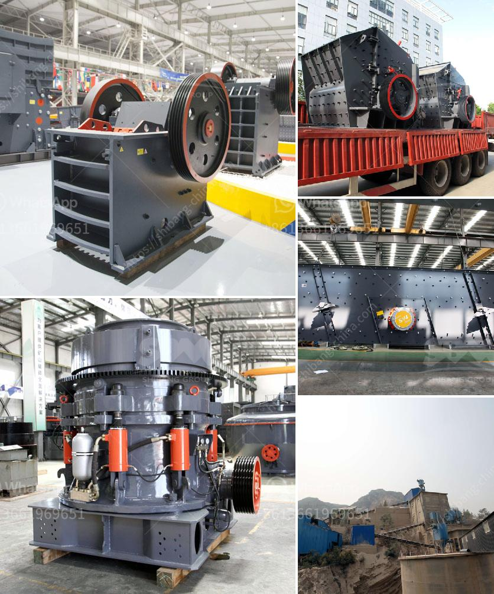

<h3>limestone grinding mill unit manufacturers</h3>
Limestone is a common mineral found in nature which is mainly composed of calcium carbonate (CaCO3). Limestone is widely used in various industries such as construction, cement, and steel, due to its high hardness, purity, and versatility. To meet the growing demand for limestone, limestone grinding mill unit manufacturers have emerged as key players in the market.

Limestone grinding mills are typically designed for limestone grinding, enabling the production of limestone powder with a wide range of particle sizes. They operate by utilizing the friction and shear forces generated between the grinding media and the feed material as the mill rotates, grinding the feed material into fine powder. The limestone grinding mill unit manufacturers offer a variety of models and designs suitable for different applications, ranging from small scale to large scale production.

One of the major advantages of limestone grinding mills is their ability to produce high-quality limestone powder, which is widely used in applications such as building materials, coatings, and fillers. The fine particles produced by limestone grinding mills have a uniform particle size distribution, high whiteness, and good chemical stability, making them ideal for various industrial uses.

In addition to high-quality limestone powder, limestone grinding mills also offer numerous other benefits. For instance, they are energy efficient, consuming less power per unit of production compared to other grinding mills. This not only reduces operation costs for manufacturers but also helps in minimizing the environmental impact. The compact design of limestone grinding mills further contributes to their energy efficiency, as they require less space and can be easily integrated into existing production lines.

Another advantage of limestone grinding mills is their versatility. They can be used to grind a variety of materials apart from limestone, including feldspar, talc, barite, dolomite, kaolin, and bentonite. This makes limestone grinding mills suitable for a wide range of applications in industries such as mining, metallurgy, chemical engineering, and agriculture.

However, with the increasing number of limestone grinding mill unit manufacturers in the market, it is important for buyers to carefully evaluate and choose the right manufacturer. Factors such as the manufacturer's reputation, quality of equipment, after-sales service, and price should be considered.

In conclusion, limestone grinding mill unit manufacturers play a critical role in meeting the demand for limestone and its derived products. Their ability to produce high-quality limestone powder, energy efficiency, versatility, and cost-effectiveness make them indispensable for various industries. As the market continues to grow, it is crucial for buyers to make informed decisions while selecting limestone grinding mill unit manufacturers to ensure a reliable and efficient production process.
<h3>Contact us</h3><ul><li><strong>Whatsapp:&nbsp;<a href="https://wa.me/8613661969651">+8613661969651</a></strong></li><li><a href="https://swt.shibang-china.com/?git&amp;zhl&amp;limestone grinding mill unit manufacturers"><strong>Online Service(chat now)</strong></a></li></ul><h3>Related</h3><ul><li><a href='price of crusher sand in tons south africa.md'>price of crusher sand in tons south africa</a></li><li><a href='cost of malaysia mobile crusher in india.md'>cost of malaysia mobile crusher in india</a></li><li><a href='sand powder milling machine.md'>sand powder milling machine</a></li><li><a href='25 tph vsi crushers.md'>25 tph vsi crushers</a></li><li><a href='chart of accounts for cement factory.md'>chart of accounts for cement factory</a></li></ul>