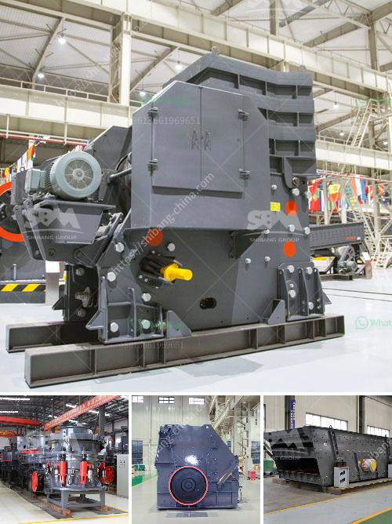

<h3>limestone grinding process</h3>
Limestone is a common rock found in nature, which is primarily composed of calcium carbonate. Calcium carbonate is a beneficial compound used in various industries, including construction, agriculture, pharmaceuticals, and more. However, in order to utilize limestone effectively, it needs to be ground into a fine powder. This article explores the limestone grinding process and the importance of efficient grinding techniques.

The process of grinding limestone primarily involves the following stages: crushing, drying, grinding, and classification. These processes consume a considerable amount of energy and time, making it crucial to use the most efficient equipment available.

The first step in the limestone grinding process is crushing. Numerous crushers are used to extract the desired limestone, often resulting in a wide range of sizes. To achieve the desired particle size, these limestone chunks are then subjected to a drying stage, where excess moisture is eliminated.

After drying, the next step is grinding. Limestone grinding typically involves using a ball mill or vertical roller mill to produce a fine powder, which is then used in various applications, such as construction materials, soil amendments, chemicals, and more. Grinding the limestone ensures effective utilization of the mineral composition and improves its overall properties.

During the grinding process, the limestone is constantly subjected to impact, crushing, abrasion, and attrition. This places enormous demands on the grinding equipment and necessitates the use of efficient grinding techniques. Particle size reduction through grinding is primarily accomplished by impact and attrition forces from the grinding media. Therefore, selecting appropriate grinding media, such as steel balls or ceramic beads, is essential for achieving the desired particle size range and ensuring the longevity of the grinding equipment.

Furthermore, efficient classification methods are crucial for achieving a consistent particle size distribution. Air classifiers, cyclones, and sieves are commonly used in limestone grinding to separate the ground powder into different size fractions. This ensures that the final product meets the desired specifications and is suitable for its intended end use.

In conclusion, limestone grinding is a crucial stage in the utilization of limestone. Efficient grinding techniques are essential for achieving the desired particle size distribution and properties. The process involves various stages, including crushing, drying, grinding, and classification. It requires the use of appropriate grinding media and classification equipment to optimize the grinding process and ensure consistent and high-quality limestone powder.
<h3>Contact us</h3><ul><li><strong>Whatsapp:&nbsp;<a href="https://wa.me/8613661969651">+8613661969651</a></strong></li><li><a href="https://swt.shibang-china.com/?git&amp;zhl&amp;limestone grinding process"><strong>Online Service(chat now)</strong></a></li></ul><h3>Related</h3><ul><li><a href='prices of crusher machine in pakistan.md'>prices of crusher machine in pakistan</a></li><li><a href='starting a quarry business in nigeria.md'>starting a quarry business in nigeria</a></li><li><a href='ball mills for mica powder.md'>ball mills for mica powder</a></li><li><a href='screw conveyor for sand.md'>screw conveyor for sand</a></li><li><a href='stone crushing machineries imphal.md'>stone crushing machineries imphal</a></li></ul>