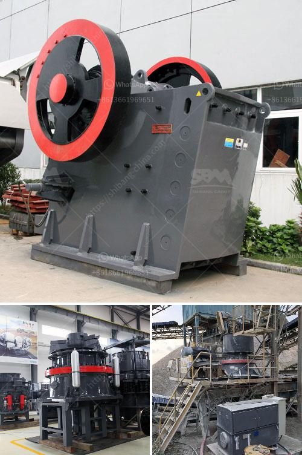

<h3>limestone grinding technology and</h3>
Limestone is a staple material in various industries, particularly in construction and building materials. It is a sedimentary rock composed mainly of calcium carbonate, which gives it its characteristic white color. Limestone is widely used in the production of cement, mortar, lime, and other building materials, making it an essential element in infrastructure development.

To harness the full potential of limestone, it must be processed through grinding technology. Limestone grinding involves reducing the size of limestone particles, which enhances its reactivity and allows it to be utilized more effectively. This process involves crushing limestone to a powder form, and then grinding it in a ball mill or hammer mill until it is desired fineness. The resulting powder is then mixed in exact proportions with other materials to produce cement.

Over the years, advancements in limestone grinding technology have enabled cement manufacturers to improve efficiency and sustainability in their operations. The introduction of advanced grinding mills, such as vertical roller mills and high-pressure grinding rolls, has significantly enhanced the grinding process.

One notable technology in limestone grinding is the use of vertical roller mills. These mills grind the limestone to produce ultra-fine cement powders, which are more reactive and have a higher surface area compared to conventionally ground cement. Vertical roller mills offer several advantages over traditional ball mills, including higher grinding efficiency, reduced power consumption, and lower operating costs. Additionally, they produce less carbon dioxide emissions, contributing to a cleaner and more sustainable environment.

Similarly, high-pressure grinding rolls (HPGR) have emerged as an effective technology for limestone grinding. HPGRs compress and grind the limestone particles between two rotating rollers, creating a fine and uniform product. This technology provides excellent energy efficiency and can reduce the power consumption of the grinding process by up to 40%. Furthermore, HPGRs have a smaller footprint compared to traditional grinding mills, allowing for more compact and efficient plant designs.

The adoption of advanced grinding technologies not only improves the efficiency of limestone grinding but also contributes to sustainability efforts in the cement industry. By reducing power consumption and carbon dioxide emissions, these technologies align with the global objectives to combat climate change and reduce environmental impact.

Moreover, the use of advanced grinding technologies enhances the potential for utilizing alternative raw materials and industrial by-products in cement production. Certain materials, such as slag, fly ash, and silica fume, can be blended with limestone during the grinding process to produce blended cements with improved properties. This approach not only conserves natural resources but also reduces the amount of waste requiring disposal, promoting a circular economy.

In conclusion, limestone grinding technology has come a long way, offering numerous benefits for cement manufacturers. The use of advanced grinding mills such as vertical roller mills and high-pressure grinding rolls has improved efficiency, reduced energy consumption, and lowered carbon dioxide emissions. Furthermore, these technologies open the door to utilizing alternative raw materials, contributing to sustainability efforts and promoting a circular economy. As the construction industry continues to evolve and prioritize sustainability, limestone grinding technology will play an integral role in driving forward a greener and more sustainable future.
<h3>Contact us</h3><ul><li><strong>Whatsapp:&nbsp;<a href="https://wa.me/8613661969651">+8613661969651</a></strong></li><li><a href="https://swt.shibang-china.com/?git&amp;zhl&amp;limestone grinding technology and"><strong>Online Service(chat now)</strong></a></li></ul><h3>Related</h3><ul><li><a href='slag crusher cost.md'>slag crusher cost</a></li><li><a href='cost of dolomite milling machine in india.md'>cost of dolomite milling machine in india</a></li><li><a href='conveyor belt capacity.md'>conveyor belt capacity</a></li><li><a href='counting sensors for conveyor belts.md'>counting sensors for conveyor belts</a></li><li><a href='quarry crusher quartz.md'>quarry crusher quartz</a></li></ul>