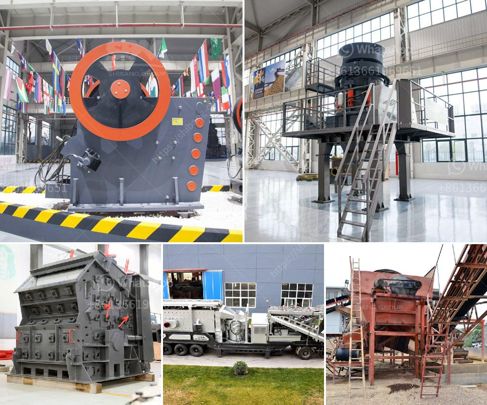

<h3>limestone mill suppliers in china</h3>
Limestone is a sedimentary rock composed largely of calcium carbonate (CaCO3). Limestone powders are widely used in different industries such as construction, agriculture, and cement production. With China being the leading supplier of limestone mill machinery and equipment globally, it is essential to understand the role played by Chinese manufacturers in providing high-quality grinding equipment to customers worldwide.

China has a rich resource of limestone mines, with vast deposits located in different provinces. As a result, the country has become a significant player in the global limestone milling industry. Chinese limestone mill suppliers have gained a strong reputation for their advanced machinery, exceptional performance, and competitive prices.

One of the primary reasons why limestone mill suppliers from China are preferred is the advanced technology they employ in their machinery. Chinese manufacturers invest heavily in research and development to improve the efficiency and durability of their grinding mills. This allows them to produce equipment that can handle large volumes of limestone grinding with minimal energy consumption.

Chinese limestone mill suppliers also focus on the quality of their products. They use high-quality materials and precise manufacturing processes to ensure that their mills have a long service life and provide consistent results. Additionally, Chinese manufacturers adhere to stringent quality control measures to guarantee that every machinery leaving their factories meets the highest standards.

In terms of pricing, limestone mill suppliers in China offer competitive rates compared to manufacturers from other countries. This is primarily due to the lower production costs in China, including lower labor and raw material costs. Chinese manufacturers pass these cost advantages onto their customers, making their products more affordable and attractive to buyers worldwide.

Chinese limestone mill suppliers offer a variety of grinding equipment to suit different customer requirements. Some of the commonly available limestone mills include Raymond mill, ball mill, vertical roller mill, and ultra-fine grinding mill. Raymond mill, or Raymond grinder, is a grinding machine from abroad with long history and advanced technology. Raymond mill technology has applied to many traditional grinder machines such as Raymond ball mill, Raymond vertical mill, Raymond coal mill, Raymond roller mill, etc.

Ball mill, also called tube mill, is important grinding equipment in cement production process. After being crushed, the raw meal enters the ball mill for further grinding. Ball mill is also widely applied in the areas of chemical industry, construction materials, electric power, and metallurgy.

Vertical roller mill, as an energy-saving grinding equipment, is gradually replacing traditional ball mills in cement plants. It has the advantages of high grinding efficiency, low power consumption, small occupation area, and low investment cost.

Ultra-fine grinding mill, with the advancement of modern technology, is becoming more popular in the market. It has a wider application range, from limestone powder production to other industrial minerals grinding.

In conclusion, Chinese limestone mill suppliers have made significant contributions to the global limestone milling industry. Their advanced technology, high-quality products, and competitive pricing have made them favorable choices for customers worldwide. As China continues to expand and improve its limestone mill manufacturing capabilities, it is expected to maintain its position as a leading supplier in the future.
<h3>Contact us</h3><ul><li><strong>Whatsapp:&nbsp;<a href="https://wa.me/8613661969651">+8613661969651</a></strong></li><li><a href="https://swt.shibang-china.com/?git&amp;zhl&amp;limestone mill suppliers in china"><strong>Online Service(chat now)</strong></a></li></ul><h3>Related</h3><ul><li><a href='marble stone milling plant manufacturer.md'>marble stone milling plant manufacturer</a></li><li><a href='stone crusher coalaries.md'>stone crusher coalaries</a></li><li><a href='coal crusher size 100 tph.md'>coal crusher size 100 tph</a></li><li><a href='rental of crusher in malaysia.md'>rental of crusher in malaysia</a></li><li><a href='crusher plant supplier in nepal.md'>crusher plant supplier in nepal</a></li></ul>