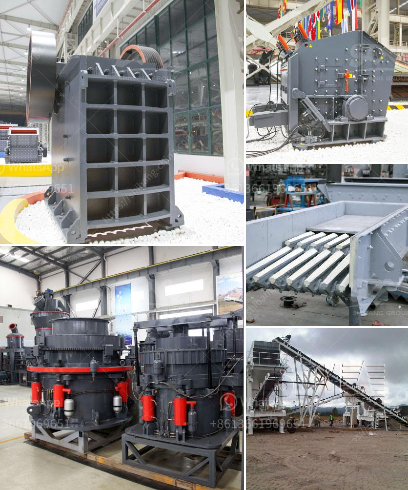

<h3>limestone mines for sale in cambodia</h3>
Cambodia, a country known for its rich cultural heritage and stunning landscapes, is also home to an abundance of natural resources, including limestone. This sedimentary rock, formed over millions of years, has a wide range of applications and is widely used in construction, agriculture, and various industrial processes.

For investors looking to explore new opportunities in the mining sector, limestone mines in Cambodia provide a hidden gem. With its strategic location in Southeast Asia, the country offers excellent potential for economic growth, attracting foreign investors from all over the world.

Limestone mines for sale in Cambodia present a unique investment opportunity due to several factors. Firstly, the demand for limestone is ever-increasing, both domestically and internationally. Its versatility and high calcium content make it an essential ingredient for cement production, a crucial component for infrastructure development. With Cambodia's ongoing infrastructure projects and its proximity to rapidly developing economies like Vietnam and Thailand, the demand for limestone is expected to soar.

Secondly, Cambodia's mining industry is still relatively untapped, offering investors a chance to enter a market with limited competition. The government has shown support for the growth of the sector by streamlining the mining licensing process and providing incentives for investors. This business-friendly environment, combined with the potential for substantial profits, makes limestone mines in Cambodia an attractive proposition.

Furthermore, the geology of Cambodia is favorable for limestone mining, with vast deposits spread across the country. Regions like Pursat, Kampot, and Koulen Mountain are known for their high-quality limestone, making them prime locations for mining operations.

Investing in limestone mines in Cambodia not only promises profitable returns but also provides opportunities for sustainable development. With responsible mining practices and proper environmental management, investors can contribute to the economic growth of the country while protecting its natural resources.

In conclusion, limestone mines for sale in Cambodia offer a unique investment opportunity for those looking to diversify their portfolio or venture into the mining sector. With increasing demand, a supportive government, and favorable geological conditions, the potential for success in this industry is substantial. Taking advantage of this hidden gem can lead to long-term financial gains and contribute to Cambodia's economic development.
<h3>Contact us</h3><ul><li><strong>Whatsapp:&nbsp;<a href="https://wa.me/8613661969651">+8613661969651</a></strong></li><li><a href="https://swt.shibang-china.com/?git&amp;zhl&amp;limestone mines for sale in cambodia"><strong>Online Service(chat now)</strong></a></li></ul><h3>Related</h3><ul><li><a href='price of gypsum plant.md'>price of gypsum plant</a></li><li><a href='stone quarry crusher in ghana.md'>stone quarry crusher in ghana</a></li><li><a href='costs of conveyor belts.md'>costs of conveyor belts</a></li><li><a href='ball mill for quartz grinding gujarat.md'>ball mill for quartz grinding gujarat</a></li><li><a href='aggregate crushing plant layout.md'>aggregate crushing plant layout</a></li></ul>