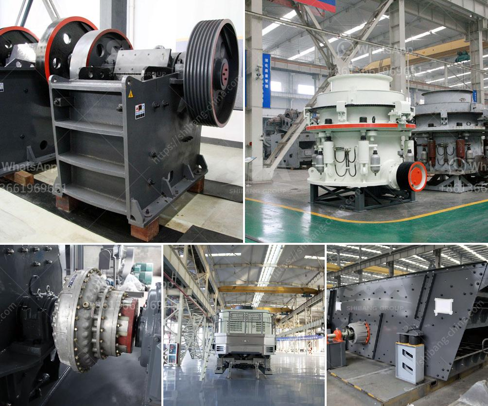

<h3>limestone powder machine</h3>
Limestone powder machine is a kind of equipment that is used for grinding the limestone into fine powder, which is widely used in industry sectors including metallurgy, building materials, chemical industry, etc. To grind limestone into powder, we need limestone grinding mill machine, and we also need a series of accessories such as bucket elevator, vibrating feeder, hopper, etc.

The quality of the limestone powder machine directly affects the price. A high-quality machine not only has a long service life, but also has stable performance and high grinding efficiency. Therefore, when purchasing a limestone powder machine, it is important to choose a reliable manufacturer and a high-quality machine.

The production capacity of the limestone powder machine also affects the price. Different machines have different output capacities, and the price will vary accordingly. If you have a large production demand, you need to choose a machine with a larger production capacity, but the price will also be higher.

The after-sales service provided by the manufacturer also affects the price of the machine. A manufacturer with good after-sales service can provide timely technical support, equipment maintenance and other services, which can save a lot of costs for customers. Therefore, when purchasing a limestone powder machine, it is necessary to consider the after-sales service provided by the manufacturer.

The market demand for limestone powder machines also affects the price. If the market demand is high, the price of the machine will be relatively high. On the contrary, if the market demand is low, the price of the machine may be relatively low. Therefore, before purchasing a limestone powder machine, it is necessary to understand the market demand to make a reasonable budget.

In conclusion, limestone powder machine is an essential equipment in the limestone grinding process. The price of the machine is influenced by factors such as the quality of equipment, production capacity, after-sales service, and market demand. When purchasing a limestone powder machine, it is necessary to consider these factors comprehensively to choose a cost-effective machine.
<h3>Contact us</h3><ul><li><strong>Whatsapp:&nbsp;<a href="https://wa.me/8613661969651">+8613661969651</a></strong></li><li><a href="https://swt.shibang-china.com/?git&amp;zhl&amp;limestone powder machine"><strong>Online Service(chat now)</strong></a></li></ul><h3>Related</h3><ul><li><a href='price on a mining ball mill 10 tons per hour.md'>price on a mining ball mill 10 tons per hour</a></li><li><a href='mini jaw crusher saudi.md'>mini jaw crusher saudi</a></li><li><a href='gypsum manufacturing unit in nigeria.md'>gypsum manufacturing unit in nigeria</a></li><li><a href='desain mesin crusher tempurung kelapa.md'>desain mesin crusher tempurung kelapa</a></li><li><a href='hammer mill machinery in namibia.md'>hammer mill machinery in namibia</a></li></ul>