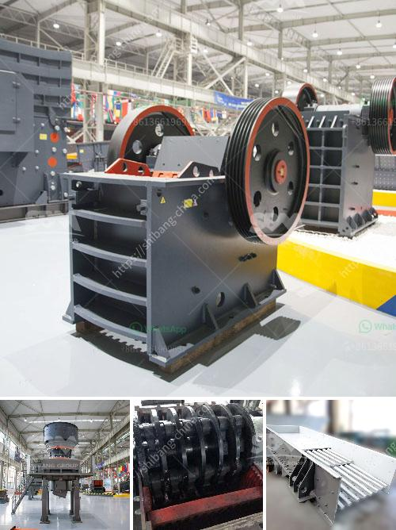

<h3>limestone primary crushing plant</h3>
Limestone is an important raw material in industrial production. It is widely used in construction, agriculture, chemical engineering, cement production, etc. Limestone is mined from limestone deposits and then transported to the primary crushing plant. The jaw crusher is commonly used as the primary crusher, and impact crusher, cone crusher is used as secondary crusher. The mobile crushing plant can be directly installed and operated on the site, which saves a lot of transportation costs for users. According to user needs, crushing production line can be customized, and production capacity and installation can be selected.

Limestone primary crushing plant mainly refers to the crushing stage where large size limestone rocks are crushed into smaller particles. Here are some popular limestone crusher machines from SBM:

- Jaw crusher: In the limestone crushing plant, jaw crusher is used as the primary crusher. Jaw crusher is mainly used for medium-sized crushing of various ores and bulk materials, and can crush materials with compressive strength not more than 320Mpa, which are divided into coarse and fine broken. The series of products are complete in specifications, and the feed size ranges from 125mm to 750mm. It is the first choice for primary crushing equipment.

- Impact crusher: Impact crusher is a high-performance secondary crushing equipment. It is mainly used for crushing various medium and hard amterials, such as granite, limestone, river pebble, cement clinker, quartz stone, iron ore, bauxite and other minerals. Users can adjust the gap between the impact rack and rotor to achieve the purpose of changing the particle size and shape of the finished product.

- Cone crusher: Cone crusher is suitable for crushing various hardness materials. It has the advantages of large output, high production efficiency, user-friendly design, stable operation and low failure rate. Cone crusher is an ideal choice for crushing hard or medium-hard materials, and is often used in gravel production lines.

- Mobile crushing plant: The mobile crushing plant is flexible and convenient, strong mobility, can directly crush materials on site, saving a lot of infrastructure and relocation costs, and widely used in metallurgy, chemical industry, building materials, water and electricity, etc. The equipment is especially suitable for smaller spaces or sites with complex environments, and it is very popular among users.

In conclusion, the limestone primary crushing plant plays a critical role in the limestone processing process. It is the main equipment in limestone crushing process and is indispensable. The limestone can be directly processed into stone and burned into lime, which can be used in various industries such as construction, agriculture, metallurgy and chemical industry. With the continuous development of technology, the limestone primary crushing plant will continue to be upgraded and improved to meet the needs of different users, and make greater contributions to the construction of modern industry and infrastructure.
<h3>Contact us</h3><ul><li><strong>Whatsapp:&nbsp;<a href="https://wa.me/8613661969651">+8613661969651</a></strong></li><li><a href="https://swt.shibang-china.com/?git&amp;zhl&amp;limestone primary crushing plant"><strong>Online Service(chat now)</strong></a></li></ul><h3>Related</h3><ul><li><a href='coal crushing machine.md'>coal crushing machine</a></li><li><a href='coal mill in china.md'>coal mill in china</a></li><li><a href='3 roll mill specifications.md'>3 roll mill specifications</a></li><li><a href='bauxite calcination plant cost in india.md'>bauxite calcination plant cost in india</a></li><li><a href='detail project report on quartz powder plant.md'>detail project report on quartz powder plant</a></li></ul>