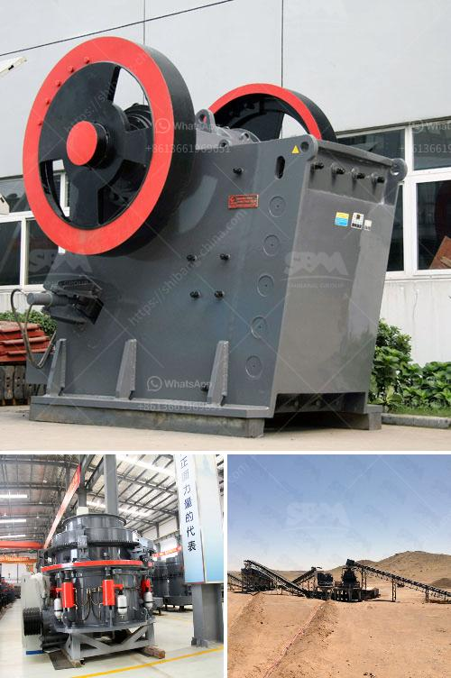

<h3>limestone processing in nigeria</h3>
Limestone is a sedimentary rock that is versatile and used for various purposes, including the manufacturing of cement, paint, paper, tiles, and construction materials. Its production can also lead to economic growth and job creation in Nigeria. Limestone processing involves several steps that showcase how this rock is transformed into a marketable product.

The first step in limestone processing is quarrying. This involves the extraction of limestone blocks or pieces from a limestone deposit using heavy machinery. After quarrying, the next step is to transport the limestone blocks to a processing plant where they will be crushed, milled, and screened to obtain various sizes of limestone products.

The crushing stage is crucial in limestone processing as it breaks down large pieces of rock into smaller, more manageable sizes. Crushing equipment, such as jaw crushers, gyratory crushers, cone crushers, and impact crushers, are commonly used in this stage. These crushers reduce the limestone to a size suitable for further processing.

Next, the milled limestone is sent to a screening plant. The purpose of screening is to separate the limestone into different sizes or grades based on market demands. Vibrating screens and trommel screens are commonly used in this process. The screened limestone is then sold as a raw material for further processing or used directly in various industries.

One of the major uses of limestone is in cement manufacturing. To produce cement, limestone undergoes a calcination process, where it is heated to a high temperature to release carbon dioxide, leaving behind calcium oxide or quicklime. This quicklime is then mixed with other materials, such as clay or sand, and water to form a paste that hardens to become cement.

Apart from cement, limestone is also used in the production of paints, coatings, and pigments. Its high brightness and ability to enhance color make it a valued ingredient in these industries. Limestone is also used as a filler in paper production, improving its quality and reducing costs.

In Nigeria, limestone processing is a profitable venture because of its extensive usage and demand across different industries. In 2017, Nigeria was the largest limestone producer in Africa, accounting for over 50% of the total limestone production on the continent. Since limestone deposits can be found in every state in the country, Nigeria has the potential to become a major exporter of limestone in the African region.

Limestone processing plants are scattered across the state in locations such as Abakaliki, Izzi, and Okpella, among others. As Nigeria opens up its market to international players, local limestone miners and processors should position themselves strategically to take advantage of the available opportunities.

Furthermore, the limestone processing industry in Nigeria holds great potential for job creation as it requires skilled labor for various stages of processing. Engineers, geologists, machine operators, and technicians are just a few of the professionals needed in this sector. With proper investment in training and infrastructure, the limestone processing industry can contribute significantly to Nigeria's economy.

In conclusion, limestone processing in Nigeria plays a vital role in various industries. From quarrying to manufacturing, this rock can be transformed into valuable products with economic benefits. Nigeria has vast limestone deposits, making it a potential leader in limestone production and exportation in Africa. It is crucial for the government to support and invest in this sector to stimulate economic growth and create employment opportunities.
<h3>Contact us</h3><ul><li><strong>Whatsapp:&nbsp;<a href="https://wa.me/8613661969651">+8613661969651</a></strong></li><li><a href="https://swt.shibang-china.com/?git&amp;zhl&amp;limestone processing in nigeria"><strong>Online Service(chat now)</strong></a></li></ul><h3>Related</h3><ul><li><a href='portable crusher plant.md'>portable crusher plant</a></li><li><a href='toggle plate of jaw crusher.md'>toggle plate of jaw crusher</a></li><li><a href='150 tph mobile jaw crusher for sale in malaysia.md'>150 tph mobile jaw crusher for sale in malaysia</a></li><li><a href='prices of conveyor belts for mining.md'>prices of conveyor belts for mining</a></li><li><a href='gypsum board making machinery.md'>gypsum board making machinery</a></li></ul>