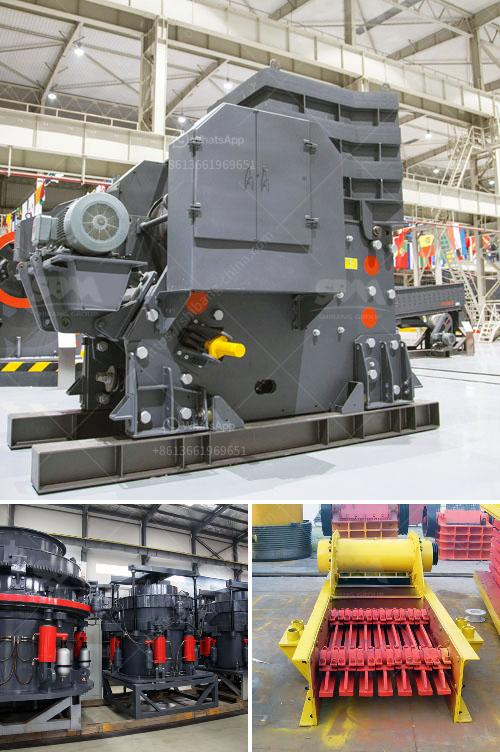

<h3>limestone processing plant company</h3>
Limestone is a sedimentary rock composed mostly of calcium carbonate (CaCO3), used primarily in the construction industry. Its wide range of applications includes building materials, road construction, agriculture, and even chemicals. To meet the growing demand for limestone, a significant investment in limestone processing plants is required.

One such company that understands the importance of limestone processing is ABC Limestone Processing Plant Company. With years of experience in the industry, ABC Company has established an efficient and reliable limestone processing plant to meet the needs of its customers.

The limestone processing plant operated by ABC Company follows a high-precision and state-of-the-art approach to extract limestone and produce various limestone products. The process begins with the extraction of raw limestone from the quarry. Using advanced drilling machinery and explosives, the rock is carefully blasted into manageable sizes. This ensures minimal damage to the limestone during the extraction process.

Once extracted, the limestone is transported to the processing plant. ABC Company maintains a fleet of modern trucks and loaders to ensure the smooth and timely transportation of the raw material. At the processing plant, the limestone is crushed into small pieces using crushers. These crushers are designed to break down rocks into specific sizes that meet the customer's requirements.

After the initial crushing stage, the limestone undergoes further processing to produce the desired products. ABC Company invests in advanced machinery and equipment to ensure the highest quality of their limestone products. Various techniques such as grinding, screening, and washing are employed to refine the limestone and remove impurities.

The final products from the limestone processing plant are used in various industries. Crushed limestone is commonly used as a base material for roads, driveways, and foundations. Its durability and stability make it an excellent choice for construction projects. Additionally, crushed limestone is also used in the manufacturing of cement, asphalt, and concrete.

ABC Company takes pride in its commitment to environmental sustainability. The limestone processing plant is designed to minimize its impact on the environment. Proper waste management systems are in place to ensure the responsible disposal of any waste generated during the processing operations.

Furthermore, ABC Company is dedicated to ensuring the safety and well-being of its employees. The processing plant is equipped with the latest safety features and adheres to strict safety protocols to protect the workers.

With its efficient limestone processing plant, ABC Company has established itself as a reliable and customer-oriented provider of limestone products. The company's dedication to quality, sustainability, and safety sets it apart from the competition.

In conclusion, the importance of limestone processing cannot be overstated. ABC Limestone Processing Plant Company understands this significance and has invested in a state-of-the-art facility to meet the growing demand for limestone products. With its commitment to quality, sustainability, and safety, ABC Company has earned a reputable position in the industry and continues to play a vital role in the construction, agriculture, and chemical sectors.
<h3>Contact us</h3><ul><li><strong>Whatsapp:&nbsp;<a href="https://wa.me/8613661969651">+8613661969651</a></strong></li><li><a href="https://swt.shibang-china.com/?git&amp;zhl&amp;limestone processing plant company"><strong>Online Service(chat now)</strong></a></li></ul><h3>Related</h3><ul><li><a href='price on a mining ball mill 10 tons per hour.md'>price on a mining ball mill 10 tons per hour</a></li><li><a href='hammer mill for sale in south africa.md'>hammer mill for sale in south africa</a></li><li><a href='crusher machines suppliers in south africa.md'>crusher machines suppliers in south africa</a></li><li><a href='raymond mill bentonite.md'>raymond mill bentonite</a></li><li><a href='cost of roller crusher.md'>cost of roller crusher</a></li></ul>