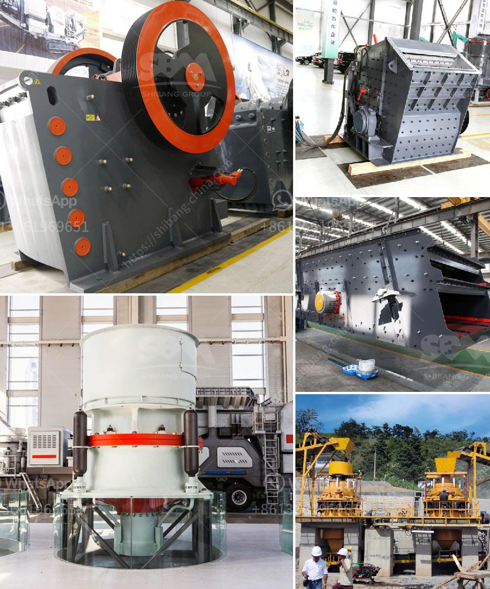

<h3>limestone processing plant price</h3>
Limestone is a common sedimentary rock found all over the world. It is primarily composed of calcium carbonate and is formed when the remains of marine organisms such as coral and shells settle and compact over time. Due to its versatility and durability, limestone is widely used in various industries, including construction, agriculture, and manufacturing.

To meet the growing demand for limestone, many companies are investing in limestone processing plants. These plants are designed to crush, grind, and separate limestone into multiple grades to meet different industries' specific requirements. However, the cost of establishing and operating a limestone processing plant can vary significantly depending on various factors such as the plant's capacity, location, equipment, and regulatory requirements.

One of the significant cost factors in establishing a limestone processing plant is the initial investment required to purchase machinery and equipment. Crushers, grinding mills, screens, and conveyors are essential equipment in limestone processing plants. The price of these machines can range from tens of thousands to hundreds of thousands of dollars, depending on their capacity and quality. Companies may consider buying new or used equipment, depending on their budget and specific requirements.

Another cost factor to consider is the location of the processing plant. If the limestone deposit is located far from urban centers or transportation infrastructure, the cost of transportation can significantly increase. This cost may include transporting the limestone from the quarry to the processing plant and delivering the processed limestone to end-users. Therefore, it is essential to choose a location close to the limestone source and transportation routes to minimize transportation costs.

Operational costs, such as labor, energy, and raw material costs, are also crucial factors in calculating the overall price of a limestone processing plant. The number of employees required to operate the plant, the energy efficiency of the machinery, and the availability and cost of limestone in the region all contribute to the operational costs. Companies must also comply with environmental regulations, which may require additional investment in pollution control equipment and waste management systems.

Despite the initial and operational costs, investing in a limestone processing plant can be highly profitable. With the increasing demand for limestone in various industries, such as construction and agriculture, companies can benefit from a steady stream of customers. Additionally, having control over the limestone processing process allows companies to offer custom grades and sizes of limestone, catering to specific industries' needs.

In conclusion, the price of a limestone processing plant can vary widely depending on factors such as the plant's capacity, location, equipment, and regulatory requirements. Companies must carefully consider these factors to determine the feasibility and profitability of investing in a limestone processing plant. While the initial investment and operational costs can be significant, the potential for long-term profitability makes it an attractive investment for companies in need of limestone for their operations.
<h3>Contact us</h3><ul><li><strong>Whatsapp:&nbsp;<a href="https://wa.me/8613661969651">+8613661969651</a></strong></li><li><a href="https://swt.shibang-china.com/?git&amp;zhl&amp;limestone processing plant price"><strong>Online Service(chat now)</strong></a></li></ul><h3>Related</h3><ul><li><a href='fluorite ore processing equipment manufacturer.md'>fluorite ore processing equipment manufacturer</a></li><li><a href='mobile crusher in sweden.md'>mobile crusher in sweden</a></li><li><a href='the world largest mobile crusher.md'>the world largest mobile crusher</a></li><li><a href='costruire une machine pour broyer des briques.md'>costruire une machine pour broyer des briques</a></li><li><a href='3 meters conveyor belts.md'>3 meters conveyor belts</a></li></ul>