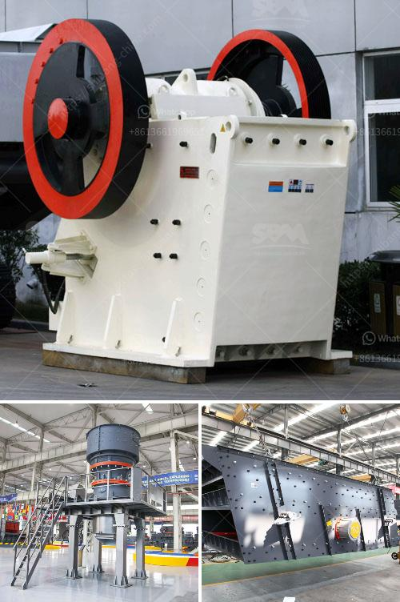

<h3>limestone processing plant supplier</h3>
Limestone is a sedimentary rock composed mostly of calcium carbonate (CaCO3), usually in the form of calcite. It is widely utilized for various construction purposes due to its versatility and durability. One crucial step in the limestone processing is obtaining the necessary equipment from a reliable supplier.

When looking to set up a limestone processing plant, it is essential to find a reputable supplier that offers high-quality equipment and reliable services. A reliable supplier will provide top-notch processing machinery tailored to meet the specific needs of the plant.

A good supplier will have an extensive range of equipment, including crushers, mills, vibrating screens, feeders, and belt conveyors. This equipment is crucial for processing limestone efficiently and effectively. The crushers will break down the large rocks into smaller, more manageable sizes, while mills will grind the limestone into fine powders.

Moreover, a reputable supplier will ensure that the equipment meets industry standards, ensuring safe and reliable operation. They will also provide necessary training and support for the installation, maintenance, and operation of the machinery, ensuring the plant operates optimally and maximizes productivity.

Additionally, it is important to consider the supplier's track record and reputation in the industry. A supplier with years of experience in the limestone processing field and a positive reputation is more likely to provide suitable equipment and excellent customer service.

In conclusion, setting up a limestone processing plant requires a reliable supplier that can deliver high-quality equipment and exceptional service. A reputable supplier will offer a wide range of machinery tailored to meet the specific needs of the plant. They will also provide training and support to ensure efficient operation. By choosing a trusted supplier, you can have confidence in the equipment's performance and the plant's success.
<h3>Contact us</h3><ul><li><strong>Whatsapp:&nbsp;<a href="https://wa.me/8613661969651">+8613661969651</a></strong></li><li><a href="https://swt.shibang-china.com/?git&amp;zhl&amp;limestone processing plant supplier"><strong>Online Service(chat now)</strong></a></li></ul><h3>Related</h3><ul><li><a href='grinding mill spare parts manufacturers china.md'>grinding mill spare parts manufacturers china</a></li><li><a href='slag grindimg in ball mill.md'>slag grindimg in ball mill</a></li><li><a href='hydrated lime machine.md'>hydrated lime machine</a></li><li><a href='vibrating feeders operating parameters from zenith china.md'>vibrating feeders operating parameters from zenith china</a></li><li><a href='kaolin processing line.md'>kaolin processing line</a></li></ul>