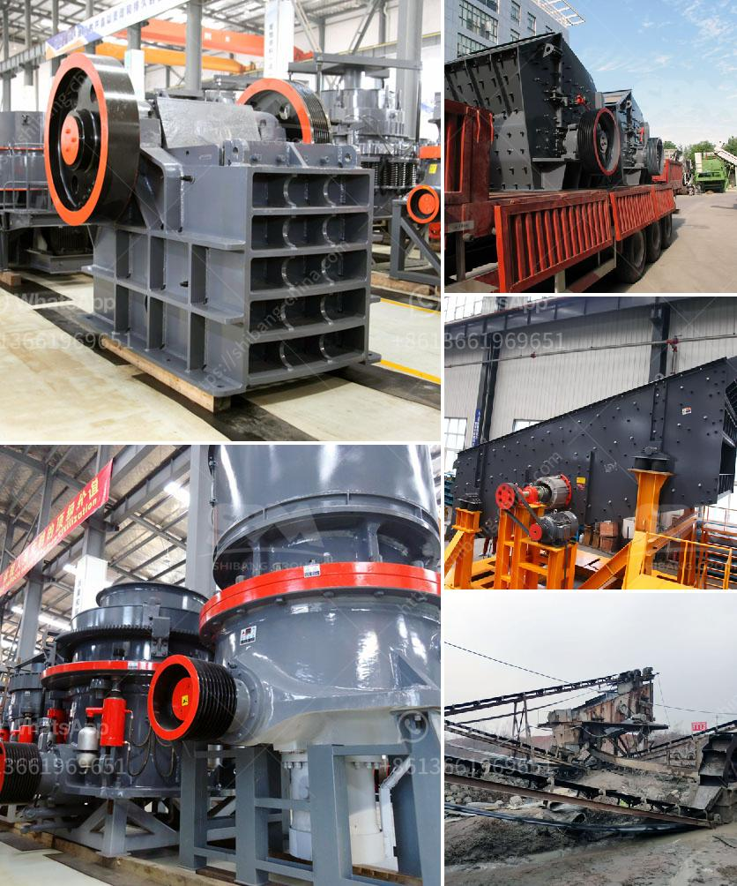

<h3>limestone production plant</h3>
When you think about all the buildings, roads, and other structures that are built every day around the world, limestone is one material that is indispensable. Due to its versatility, durability, and abundance, limestone has gained a prominent position in the construction industry. This article will delve into the essential role played by limestone production plants in ensuring a steady supply of this valuable material.

Limestone is a sedimentary rock composed primarily of calcium carbonate (CaCO3) in the form of the mineral calcite. It is formed over millions of years through the accumulation of marine organisms such as coral and shells, as well as through the deposition and compaction of sediments. The abundance and widespread distribution of limestone make it an ideal resource for the production of various construction materials.

Limestone production plants are established in areas where limestone deposits exist. Before choosing a location for the production plant, extensive geological surveys and studies are carried out to determine the quality of the limestone and its suitability for various construction applications. These studies also identify other factors such as transportation accessibility, market demand, and environmental impact.

The limestone production plant at [insert location] is capable of producing up to [insert capacity] tons per year. The plant produces limestone for various applications including cement production, aggregates, and soil amendment. Limestone and its products have numerous uses in the construction industry ranging from buildings and roads to fertilizers and soil stabilization.

One of the primary uses of limestone is in the production of cement. Cement is a key ingredient in concrete, mortar, and other construction materials. It is a fine powder obtained by heating limestone and clay minerals in a kiln to form clinker, grinding the clinker, and adding small amounts of other materials. The quality of limestone used in the cement-making process is particularly important since it directly affects the final product's strength, durability, and environmental impact.

Limestone is also crushed and used as aggregates in concrete, asphalt, and road base materials. Aggregates are essential components in construction projects and are responsible for providing strength and stability to the final structure. Due to its hardness and durability, crushed limestone is an excellent choice for these applications.

Another valuable application of limestone is in the field of agriculture. Limestone is ground into a fine powder, commonly known as agricultural lime or aglime, and used as a soil amendment to neutralize acidic soils. Calcium carbonate in the aglime helps improve soil structure, increase nutrient availability, and enhance plant growth.

In addition to its applications in construction and agriculture, limestone is also used as a raw material in the production of various other products. These include glass, ceramics, paints, coatings, plastics, and even toothpaste. The versatility of limestone makes it a crucial resource in numerous industrial processes.

Limestone production plants play a vital role in meeting the growing demand for limestone, a key component in the construction industry. With the construction sector booming, the demand for limestone is expected to grow significantly in the coming years. However, in order to fulfill the demand, the production plants must operate efficiently and optimize resource utilization to minimize environmental impact.

In conclusion, limestone production plants are crucial in ensuring a constant supply of this versatile and valuable rock for the construction industry. From cement production to road construction and agriculture, limestone serves as a fundamental material in various applications. As the demand for limestone continues to rise, production plants must keep pace and meet the ever-growing needs of the construction sector while operating sustainably.
<h3>Contact us</h3><ul><li><strong>Whatsapp:&nbsp;<a href="https://wa.me/8613661969651">+8613661969651</a></strong></li><li><a href="https://swt.shibang-china.com/?git&amp;zhl&amp;limestone production plant"><strong>Online Service(chat now)</strong></a></li></ul><h3>Related</h3><ul><li><a href='aggregate jaw crushers saudi.md'>aggregate jaw crushers saudi</a></li><li><a href='ball mill suppliers.md'>ball mill suppliers</a></li><li><a href='what is the angle of conveyor belts.md'>what is the angle of conveyor belts</a></li><li><a href='roller mill vs hammer mill.md'>roller mill vs hammer mill</a></li><li><a href='rolls crusher for sale.md'>rolls crusher for sale</a></li></ul>