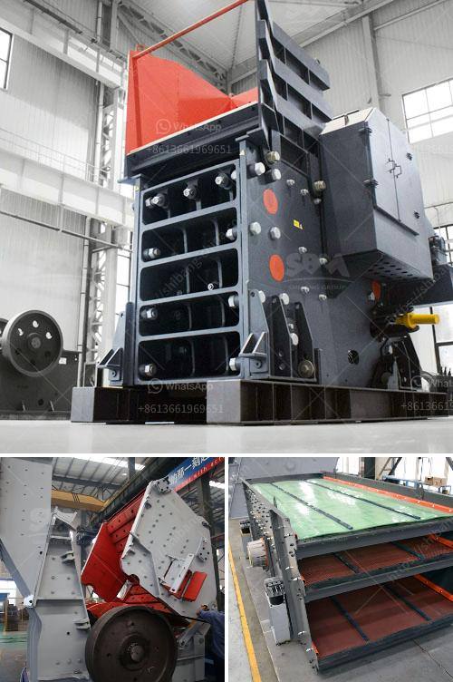

<h3>limestone rock crushing company</h3>
Limestone is a sedimentary rock composed mostly of calcium carbonate (CaCO3). It is a primary rock found in many parts of the world and can be used for various purposes, including as a building material, in construction projects, and as a raw material for manufacturing cement and other industrial processes. In order to meet the increasing demand for limestone, rock crushing companies are making significant contributions to the industry.

One such company that has established itself as a leader in the industry is the Limestone Rock Crushing Company. The company offers a wide range of services, including rock crushing, gravel and sand production, and concrete recycling. Their knowledgeable and skilled professionals have experience working on a variety of projects, ranging from residential to commercial and industrial.

One of the main reasons why the Limestone Rock Crushing Company has been so successful is their commitment to quality. They understand the importance of providing their clients with high-quality materials that meet or exceed industry standards. To achieve this, they use state-of-the-art equipment and technology to crush limestone rocks into various sizes, ensuring consistency and uniformity throughout their products.

Another factor that sets the Limestone Rock Crushing Company apart from others is their dedication to environmental sustainability. They strive to minimize the impact of their operations on the environment by implementing responsible and eco-friendly practices. For instance, they utilize dust suppression systems to control dust emissions during the crushing process. Additionally, they have adopted recycling methods to reuse concrete waste, reducing the need for additional raw materials and minimizing waste disposal.

The Limestone Rock Crushing Company takes pride in their highly trained and skilled workforce. They invest in ongoing training and development programs to ensure that their employees are up-to-date with the latest techniques and best practices in the industry. This not only enhances their productivity and efficiency but also ensures the safety of their workers and the overall success of their operations.

Furthermore, the Limestone Rock Crushing Company places a strong emphasis on customer satisfaction. They strive to build long-term relationships with their clients, understanding their specific needs and delivering customized solutions. Their experienced team is always available to answer any questions, provide guidance, and offer technical support, ensuring a seamless and positive experience for their clients.

In conclusion, the Limestone Rock Crushing Company is a leader in the industry due to its commitment to quality, environmental sustainability, and customer satisfaction. With their state-of-the-art equipment, eco-friendly practices, trained workforce, and client-focused approach, they continue to set high standards in the rock crushing industry. Whether it is for construction purposes, manufacturing, or other applications, clients can count on the Limestone Rock Crushing Company for reliable and exceptional services.
<h3>Contact us</h3><ul><li><strong>Whatsapp:&nbsp;<a href="https://wa.me/8613661969651">+8613661969651</a></strong></li><li><a href="https://swt.shibang-china.com/?git&amp;zhl&amp;limestone rock crushing company"><strong>Online Service(chat now)</strong></a></li></ul><h3>Related</h3><ul><li><a href='cone crusher manufacturer.md'>cone crusher manufacturer</a></li><li><a href='calcite powder making machine in india.md'>calcite powder making machine in india</a></li><li><a href='alluvial gold washing plant in zimbabwe.md'>alluvial gold washing plant in zimbabwe</a></li><li><a href='grinding lm vertical mill.md'>grinding lm vertical mill</a></li><li><a href='mobile quarry crushing plant price in jamaica.md'>mobile quarry crushing plant price in jamaica</a></li></ul>