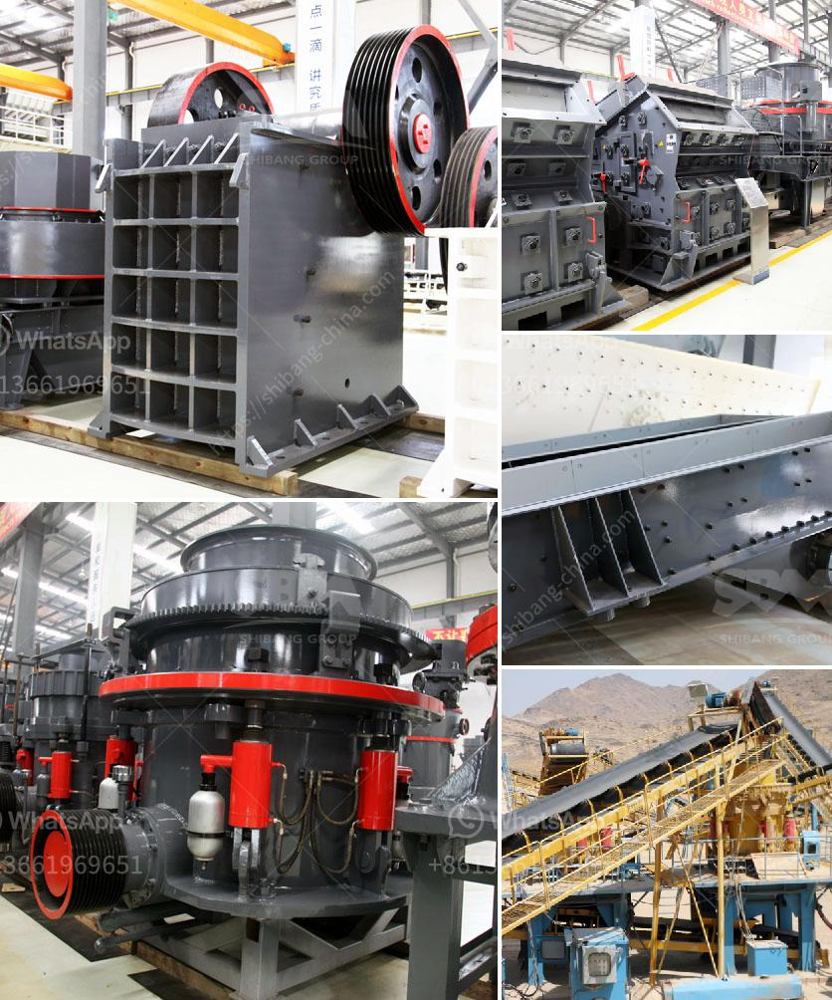

<h3>list of cement plant in india</h3>
India is the second largest cement producer in the world, after China, with a total capacity of over 500 million tonnes per year (MT). Cement is one of the oldest industries in India, and its production dates back to the pre-independence era. Over the years, there has been a significant increase in the number of cement plants in the country to meet the growing demand for this essential construction material.

1. UltraTech Cement Limited: UltraTech Cement is a subsidiary of the Aditya Birla Group and is the largest cement producer in India. It has a presence in almost all the regions of the country and operates 23 integrated plants, 1 clinkerization plant, 27 grinding units, and 7 bulk terminals.

2. Ambuja Cements Limited: Ambuja Cements is another major player in the Indian cement industry. It was established in 1983 and has a total of 5 integrated plants, 8 grinding units, and 2 blending units across the country. The company is known for its sustainable and eco-friendly practices.

3. Shree Cement Limited: Shree Cement is one of the fastest-growing cement companies in India. It has a production capacity of over 40 million tonnes per year and operates 14 grinding units and 5 integrated plants across different states in the country.

4. ACC Limited: ACC is a leading player in the Indian cement industry and has a strong presence in various parts of the country. It has 17 cement plants, 50+ concrete plants, and 2 bulk terminals with a capacity of over 36 million tonnes per year.

5. Dalmia Bharat Cement: Dalmia Bharat Cement is one of the oldest cement companies in India and was established in 1939. It operates through 3 business units - cement, sugar, and refractories, and has a total capacity of over 30 million tonnes per year.

6. Ramco Cement: Ramco Cement is a leading cement brand in South India. It has 9 cement plants with a total capacity of 16.5 million tonnes per year. The company is known for its quality and innovation in the cement industry.

7. India Cements Limited: India Cements is a prominent cement producer in South India and has a total production capacity of over 15 million tonnes per year. The company has 8 integrated cement plants, 2 grinding units, and a clinkerization plant.

8. JK Cement Limited: JK Cement is one of the top cement manufacturers in India and has a strong presence in the northern and western regions of the country. It has a total capacity of over 14 million tonnes per year and operates 3 integrated plants and 2 grinding units.

9. Birla Corporation Limited: Birla Corporation is a part of the MP Birla Group and is one of the leading cement manufacturers in India. It has 10 cement plants across the country, including 4 grinding units and a blending unit.

10. Orient Cement Limited: Orient Cement is a fast-growing cement company in India and has a total capacity of over 8 million tonnes per year. It has 3 integrated plants, 2 grinding units, and a clinkerization plant.

This is just a snapshot of some of the major cement plants in India. The country has a vast cement manufacturing industry, and there are several other players contributing to its growth. These cement plants play a vital role in the development of the infrastructure sector in India and contribute significantly to the country's economic growth.
<h3>Contact us</h3><ul><li><strong>Whatsapp:&nbsp;<a href="https://wa.me/8613661969651">+8613661969651</a></strong></li><li><a href="https://swt.shibang-china.com/?git&amp;zhl&amp;list of cement plant in india"><strong>Online Service(chat now)</strong></a></li></ul><h3>Related</h3><ul><li><a href='wet ball milling.md'>wet ball milling</a></li><li><a href='quarry business for sale in nigeria.md'>quarry business for sale in nigeria</a></li><li><a href='hand operated rock crusher.md'>hand operated rock crusher</a></li><li><a href='malaysia coconut grinder machine.md'>malaysia coconut grinder machine</a></li><li><a href='ghana quarry crusher.md'>ghana quarry crusher</a></li></ul>