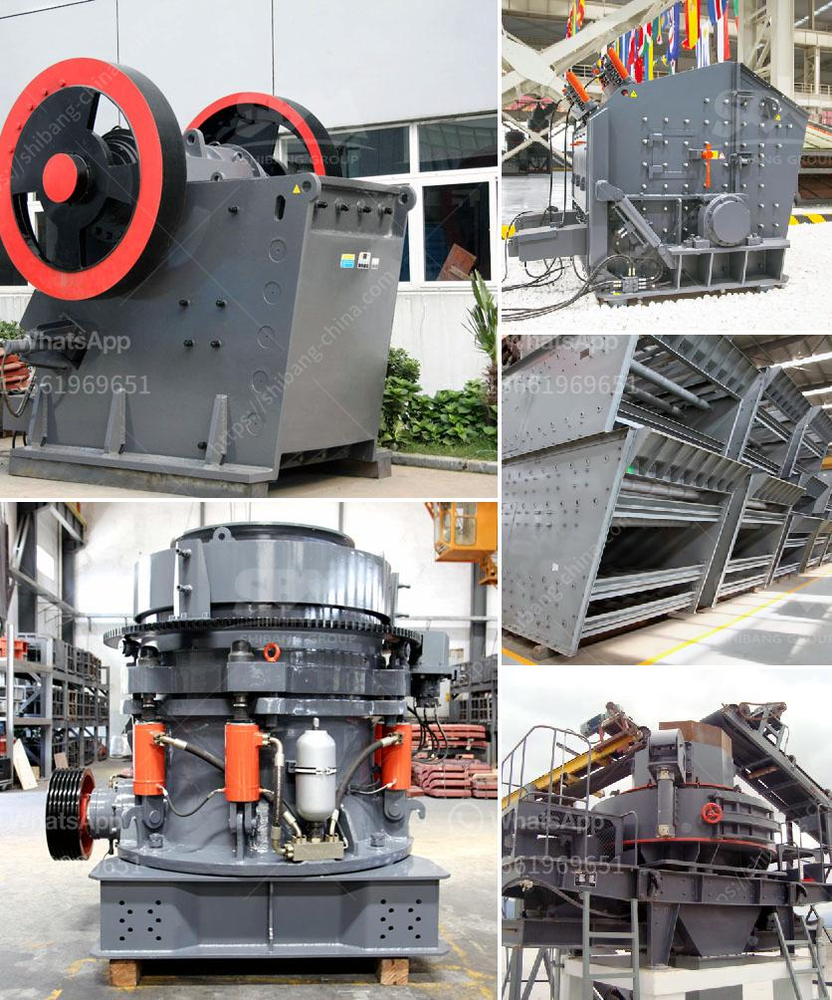

<h3>list of crusher plant</h3>
A crusher plant, also known as a crushing and screening plant, is a facility which processes stones into different sizes for use in various construction applications. The crushing process involves three stages: primary, secondary, and tertiary crushing of the stones. In this article, we will explore different types of crusher plants available in the market and their features.

Jaw crusher plants are designed to crush hard and abrasive materials such as granite, basalt, and river gravel. They are commonly used as primary crushers in the mines and quarries. A jaw crusher consists of two jaws, one fixed and the other moving, which simulates the movement of an animal's jaws towards each other. The crushing chamber is usually designed to be 'V'-shaped to efficiently capture the stones and reduce them in size.

An impact crusher plant utilizes impact forces to crush rocks and stones. The crusher rotor rotates at high speeds, causing the stones to be thrown against the breaker plates, which then impact and disintegrate the stones into smaller pieces. Impact crushers are suitable for materials with low to medium hardness, such as limestone, dolomite, and gypsum. They are commonly used in the mining and recycling industries.

Cone crusher plants are used for secondary and tertiary crushing. They have a cone-shaped crushing chamber, where the stones are repeatedly compressed and crushed until they reach the desired size. Cone crushers are ideal for materials such as basalt, granite, and limestone, as they produce a more cubical-shaped product. These plants are widely used in the construction industry for producing high-quality aggregates.

Mobile crusher plants are portable crushing units, which can be easily moved from one location to another. They are compact in size and highly efficient, making them ideal for construction sites and mining operations. Mobile crusher plants usually consist of jaw crushers or impact crushers, along with vibrating screens, conveyor belts, and control units. They are designed to provide flexibility and convenience, allowing operators to crush various types of materials in different locations.

Stationary crusher plants are fixed crushing plants that are installed in a specific location and remain non-movable. They are commonly used in mining and quarrying operations, where the stones need to be crushed at a centralized processing facility. Stationary crusher plants feature large crushers, vibrating feeders, screens, and other components. These plants are suitable for large-scale production and high-capacity applications.

In conclusion, a crusher plant is a crucial component in the construction industry. It plays a vital role in producing high-quality aggregates for various applications. The different types of crusher plants mentioned above offer different advantages and are suitable for different materials and operating conditions. Therefore, it is essential to choose the right crusher plant based on specific requirements and project constraints. With the wide variety of crusher plants available in the market, there is undoubtedly an option that will meet the needs of any construction project.
<h3>Contact us</h3><ul><li><strong>Whatsapp:&nbsp;<a href="https://wa.me/8613661969651">+8613661969651</a></strong></li><li><a href="https://swt.shibang-china.com/?git&amp;zhl&amp;list of crusher plant"><strong>Online Service(chat now)</strong></a></li></ul><h3>Related</h3><ul><li><a href='crush diabase machine.md'>crush diabase machine</a></li><li><a href='artificial marble crusher machinery.md'>artificial marble crusher machinery</a></li><li><a href='sand making machine indonesia.md'>sand making machine indonesia</a></li><li><a href='coal mill grinding media wear rate.md'>coal mill grinding media wear rate</a></li><li><a href='rotary kiln design calculations.md'>rotary kiln design calculations</a></li></ul>