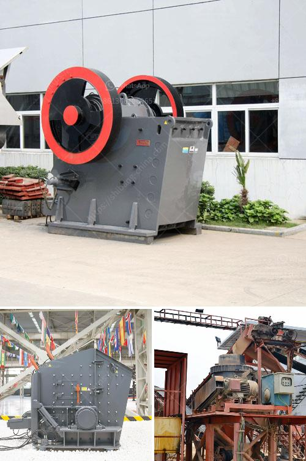

<h3>list of equipment used gold diamond mining</h3>
Gold and diamond mining is a lucrative industry that has been in existence for centuries. The mining process involves extracting precious minerals from the earth's surface or underground. This process requires the use of specialized equipment to ensure effective and efficient extraction of these minerals. In this article, we will explore a list of equipment commonly used in gold and diamond mining.

1. Excavators - Excavators are essential machines in the mining industry. These heavy-duty machines are used to remove overburden and extract the desired minerals from the ground. Excavators come in various sizes and can be equipped with different attachments such as buckets, clamshell, or hydraulic hammers.

2. Bulldozers - Bulldozers are powerful machines used to push and move large quantities of soil, rocks, and debris. In gold and diamond mining, bulldozers play a crucial role in land clearing, leveling, and creating access roads to mining sites.

3. Trommels - Trommels are cylindrical drum-like screens used to separate materials based on their size. They are used in gold mining to separate valuable minerals from the surrounding rocks and debris. Trommels are especially effective in alluvial mining, where gold particles are transported by water and deposited in riverbeds.

4. Dredges - Dredges are floating platforms equipped with equipment that extracts minerals from underwater deposits. In gold and diamond mining, dredges are used to scoop mineral-rich sediments from river bottoms or ocean floors. These sediments are then passed through a sluice box or centrifuge to extract the precious minerals.

5. Crushers - Crushers are machines used to break down large rocks and stones into smaller pieces for further processing. In gold and diamond mining, crushers are used to reduce the size of ore particles and liberate the valuable minerals trapped within.

6. Sluice boxes - Sluice boxes are long, narrow channels lined with riffles and mats. They are used to separate gold particles from the surrounding rocks and sediment. As water flows through the sluice box, it creates a current that washes away lighter materials while capturing heavy particles of gold.

7. Jigs - Jigs are gravity concentration devices that are used to separate valuable minerals based on their specific gravity. In gold and diamond mining, jigs are commonly used to concentrate and recover minerals by exploiting the differences in density between the valuable minerals and the waste materials.

8. Magnetic separators - Magnetic separators are used to separate magnetic minerals from non-magnetic minerals. They are commonly used in diamond mining to extract diamonds from the host rock. By applying a magnetic field, these separators attract and separate the diamonds from the surrounding materials.

9. X-ray sorters - X-ray sorters are advanced machines used in diamond mining to identify and separate diamonds based on their elemental composition. These sorters pass the mined material through an X-ray beam, which analyzes the atomic structure of the minerals and separates diamonds from non-diamonds based on their unique signatures.

Overall, gold and diamond mining require a range of specialized equipment to ensure efficient and effective extraction of valuable minerals. From excavators and bulldozers to crushers and magnetic separators, each piece of equipment plays a vital role in the mining process. In an industry constantly evolving and adopting new technologies, the equipment used in gold and diamond mining continues to advance to meet the demands of the industry.
<h3>Contact us</h3><ul><li><strong>Whatsapp:&nbsp;<a href="https://wa.me/8613661969651">+8613661969651</a></strong></li><li><a href="https://swt.shibang-china.com/?git&amp;zhl&amp;list of equipment used gold diamond mining"><strong>Online Service(chat now)</strong></a></li></ul><h3>Related</h3><ul><li><a href='gold mining used jaw crusher.md'>gold mining used jaw crusher</a></li><li><a href='granite processing machines china.md'>granite processing machines china</a></li><li><a href='best crusher for quartz powder.md'>best crusher for quartz powder</a></li><li><a href='sayaji impact crusher.md'>sayaji impact crusher</a></li><li><a href='quarry crusher quartz.md'>quarry crusher quartz</a></li></ul>