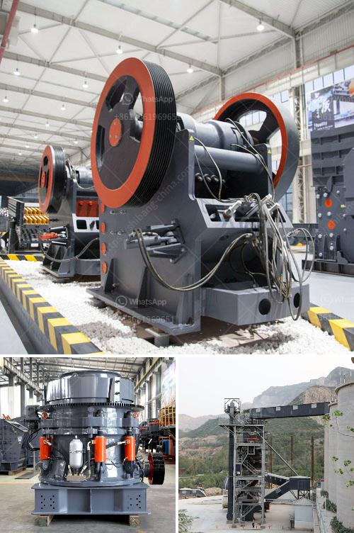

<h3>list of equipments for a quarry crusher</h3>
A quarry is a site where various types of stones are extracted from the earth. The materials obtained from the quarry are used for a variety of purposes, including construction of roads, buildings, and bridges. In order to extract the desired stones from the earth, a quarry crusher is used. A quarry crusher is a machine that breaks large stones into smaller pieces.

There are various types of quarry crushers used in the industry, depending on the type of stone deposits and the size of the desired final product. Following is a list of commonly used equipment in a quarry crusher:

1. Jaw Crusher: This type of crusher is used for breaking large-sized rocks into smaller pieces. It has a fixed jaw plate and a movable one. When the jaw crusher operates, the movable jaw compresses the rocks against the fixed jaw, crushing them into smaller sizes.

2. Impact Crusher: An impact crusher is used for crushing stones in a quarry. It works by throwing the stones against a hard surface called the impact plate. The stones are crushed into smaller pieces by the impact of the plate.

3. Cone Crusher: A cone crusher is used for crushing stones with high hardness. It has a conical-shaped crushing chamber. The stones are crushed by the squeezing action between the mantle and the concave.

4. Vibrating Feeder: A vibrating feeder is used to feed the stones into the quarry crusher. It ensures a consistent and continuous supply of stones to the crusher, improving its efficiency.

5. Vibrating Screen: A vibrating screen is used to separate the crushed stones into different sizes. The screen has multiple layers with different-sized apertures. The stones that meet the desired size criteria pass through the apertures, while the oversized stones are returned to the crusher for further crushing.

6. Belt Conveyor: A belt conveyor is used to transport the crushed stones from the crusher to a stockpile or a designated area. It reduces manual handling and improves efficiency in the quarrying process.

7. Dust Suppression System: A dust suppression system is essential in a quarry crusher to reduce the spread of dust and prevent respiratory health hazards. It consists of water sprays or chemical additives that suppress the dust generated during the crushing process.

8. Diesel Generator: A diesel generator provides power to the quarry crusher and other equipment on-site. It is essential in areas where a reliable electric power supply is not available.

9. Jaw Crushing Plant/Portable Crusher: A jaw crushing plant or a portable crusher combines multiple equipment, including a jaw crusher, vibrating feeder, and belt conveyor. It provides flexibility in terms of mobility and can be used at various locations within the quarry site.

In conclusion, a quarry crusher is an essential piece of equipment used in the stone extraction process. It breaks large stones into smaller pieces for further processing. There are various types of quarry crushers, each designed to meet specific requirements. In addition to crushers, other equipment such as vibrating feeders, screens, and conveyors play a crucial role in the quarrying process. A well-equipped quarry crusher ensures efficient and safe operations, contributing to the success of construction projects.
<h3>Contact us</h3><ul><li><strong>Whatsapp:&nbsp;<a href="https://wa.me/8613661969651">+8613661969651</a></strong></li><li><a href="https://swt.shibang-china.com/?git&amp;zhl&amp;list of equipments for a quarry crusher"><strong>Online Service(chat now)</strong></a></li></ul><h3>Related</h3><ul><li><a href='ball mill conique occasion allemand.md'>ball mill conique occasion allemand</a></li><li><a href='mobile cone crusher hire malaysia.md'>mobile cone crusher hire malaysia</a></li><li><a href='aggregate crushing plant layout.md'>aggregate crushing plant layout</a></li><li><a href='laboratory jaw crusher.md'>laboratory jaw crusher</a></li><li><a href='aggregate production plant pdf.md'>aggregate production plant pdf</a></li></ul>