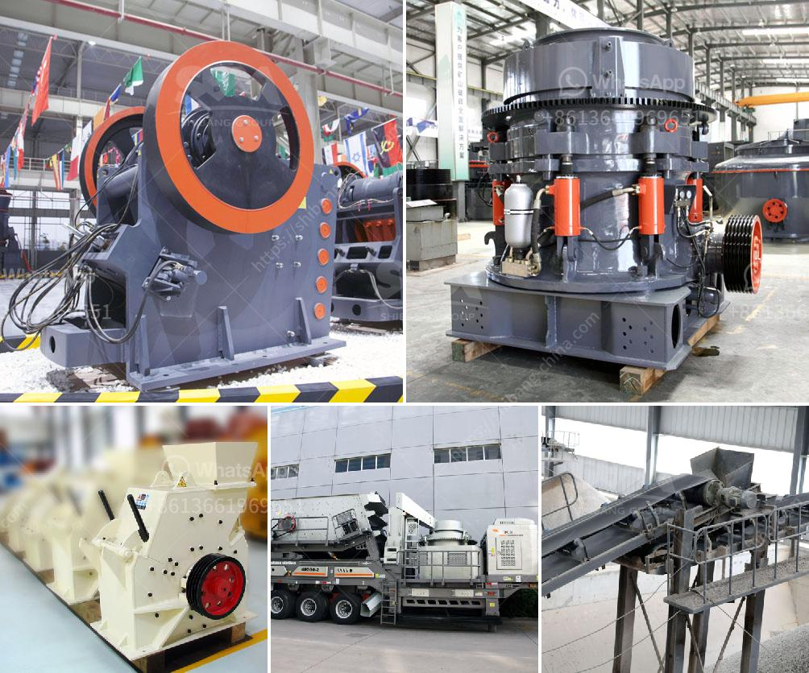

<h3>list of stone crusher equipment</h3>
Stone crushing is a crucial process in the construction, mining, and quarrying industries. The choice of equipment for this process is important as it determines the final product's quality and efficiency. As the market leader in stone crushing equipment, the company is proud to introduce a comprehensive range of stone crusher equipment.

Crushers are used to break rocks into smaller sizes, reducing them to the desired size for easy transportation and further processing. Whether you need a primary, secondary, or tertiary crusher, we have the equipment to meet your requirements. Here is a list of our stone crusher equipment:

1. Jaw Crusher: This is a heavy-duty machine that can crush hard and abrasive stones. It is ideal for primary crushing, including for large stones and rocks.

2. Impact Crusher: This machine is designed for crushing materials with high volume and high reduction ratio. It is suitable for materials with compressive strength up to 350 MPa, including limestone, dolomite, asphalt, and concrete.

3. Cone Crusher: This is a versatile crusher that combines crushing, grinding, and screening functions. It is suitable for secondary and tertiary crushing of various rocks and ores.

4. Hammer Crusher: This machine uses a series of hammers to crush materials into smaller sizes. It is suitable for crushing brittle materials, such as limestone and coal.

5. Vibrating Feeder: This equipment is used to feed the materials into the crushers evenly and continuously. It ensures a smooth and efficient feeding process, reducing the risk of clogging and maximizing the crusher's performance.

6. Vibrating Screen: This equipment is essential for separating the crushed materials into different sizes. It allows for precise control over the final product's quality and consistency.

7. Belt Conveyor: These machines are used to transport the crushed materials from one location to another. They are essential for the efficient operation of the stone crushing process.

8. Sand Making Machine: This equipment is used to produce high-quality artificial sand. It is essential for the construction industry, where natural sand is scarce or expensive.

9. Dust Collector: This machine is used to control the dust generated during the stone crushing process. It is crucial for maintaining a clean and safe working environment.

10. Control Panel: This equipment is the brain of the stone crushing operation. It allows operators to control and monitor the entire crushing process, ensuring optimal performance and safety.

In conclusion, stone crushing equipment plays a crucial role in the construction, mining, and quarrying industries. With a wide range of equipment available, the company is committed to providing efficient and high-quality solutions for its customers. Whether you need a jaw crusher, impact crusher, cone crusher, or any other type of stone crushing equipment, you can rely on our expertise and superior products.
<h3>Contact us</h3><ul><li><strong>Whatsapp:&nbsp;<a href="https://wa.me/8613661969651">+8613661969651</a></strong></li><li><a href="https://swt.shibang-china.com/?git&amp;zhl&amp;list of stone crusher equipment"><strong>Online Service(chat now)</strong></a></li></ul><h3>Related</h3><ul><li><a href='stone processing equipment turkey company.md'>stone processing equipment turkey company</a></li><li><a href='aggregate crushers for sale saudi arabia.md'>aggregate crushers for sale saudi arabia</a></li><li><a href='puzzolana stone crusher for sale.md'>puzzolana stone crusher for sale</a></li><li><a href='copper ore processing plant in philippines.md'>copper ore processing plant in philippines</a></li><li><a href='pfw series impact crusher.md'>pfw series impact crusher</a></li></ul>