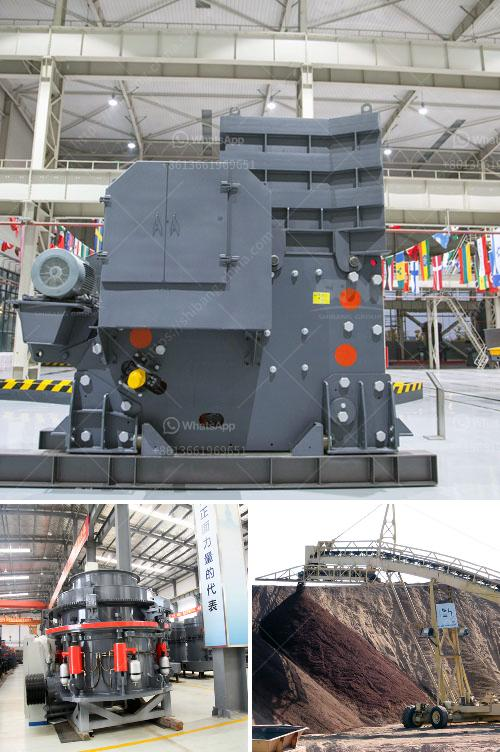

<h3>list of stone crusher plant in bangladesh</h3>
Stone crushing has long been associated with exposure to airborne crystalline silica dust to both workers and those residing in close proximity to these operations. Water spray dust control measures are effective at reducing levels of respirable crystalline silica dust. Studies have reported reductions in the range of 60% to 86% for respirable silica and dust in various applications including stone crushing, construction, mining, and manufacturing industries. Health effects of exposure to respirable crystalline silica have been well documented and include silicosis, lung cancer, pulmonary tuberculosis, and other lung diseases.

It is estimated that there are over 12,000 stone crusher units in Bangladesh. The majority of these units are located in close proximity to residential areas, resulting in numerous health issues for the workers and people residing in these areas. Stone crushing activities are also reportedly responsible for pollution of rivers, streams, and agricultural land.

The main objective of this study was to evaluate the health status of workers and residents near the stone crushing plants located in Bangladesh. Methods: Of this cross-sectional study, we included 200 workers from the stone crushing plants located in Bangladesh. The pulmonary function tests were performed using Spiro meter (Pony FX, NSpire Health Inc., Canada). The demographic and occupational history details were documented using a structured questionnaire.

The study found that among stone crusher workers, there was a significant reduction in mean forced expiratory volume (FEV1) and maximum mid expiratory flow (MMEF) values compared to controls. Similarly, among the residents living near the stone crushing plants, there was a reduction in mean FEV1 and MMEF values compared to controls.

Furthermore, the study also found high prevalence of respiratory symptoms such as cough, phlegm production, chest tightness, and shortness of breath among both the stone crusher workers and residents living near the stone crushing plants. These findings reflect the adverse health effects associated with the stone crushing activities in Bangladesh.

Given the high prevalence of stone crushing units and the associated health effects, it is imperative that appropriate preventive measures and interventions are taken to protect the health of workers and residents. These measures include the implementation of water spray dust control measures, proper ventilation systems, and the use of personal protective equipment by workers.

Additionally, it is crucial to raise awareness among workers and residents about the health risks associated with stone crushing activities and the importance of taking preventive measures. Educational campaigns and training programs should be conducted to promote safe work practices and encourage early detection of respiratory symptoms.

In conclusion, the stone crushing activities in Bangladesh have significant health implications for both workers and residents. The findings of this study underscore the urgent need for effective interventions to mitigate the adverse health effects. The government, stone crushing industry, and other stakeholders should collaborate to address this issue to ensure a safe and healthy environment for all.
<h3>Contact us</h3><ul><li><strong>Whatsapp:&nbsp;<a href="https://wa.me/8613661969651">+8613661969651</a></strong></li><li><a href="https://swt.shibang-china.com/?git&amp;zhl&amp;list of stone crusher plant in bangladesh"><strong>Online Service(chat now)</strong></a></li></ul><h3>Related</h3><ul><li><a href='china crusher exporters mails hotmail com.md'>china crusher exporters mails hotmail com</a></li><li><a href='iron crushing machine cost.md'>iron crushing machine cost</a></li><li><a href='crusher manufacturer in pune.md'>crusher manufacturer in pune</a></li><li><a href='costs for a stone crusher plant.md'>costs for a stone crusher plant</a></li><li><a href='grinding mills supplier in gujraanwala.md'>grinding mills supplier in gujraanwala</a></li></ul>