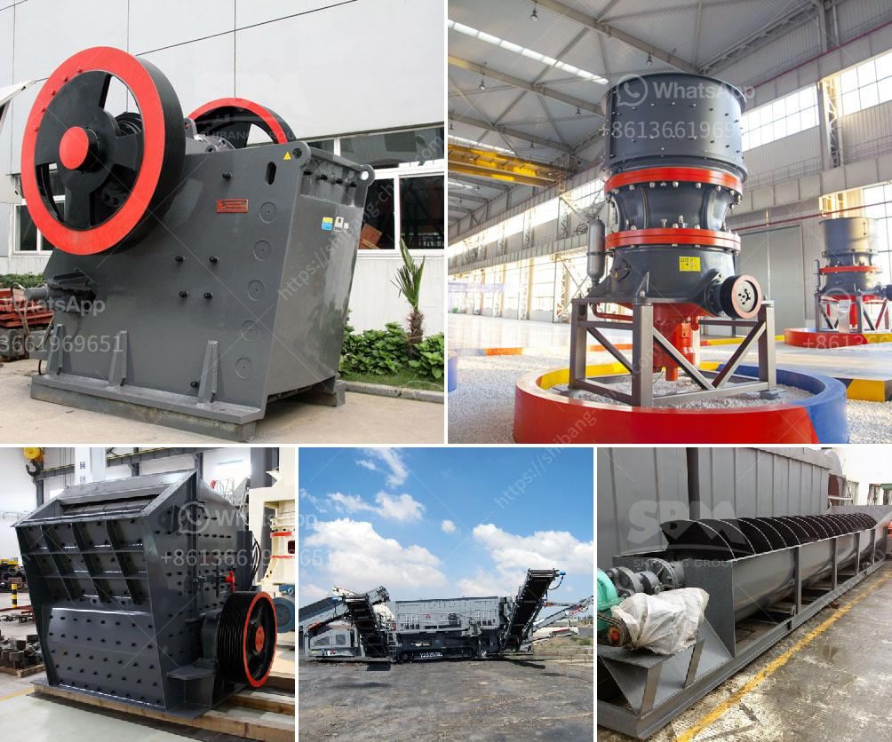

<h3>list price vibrating screen</h3>
The vibrating screen is an important piece of equipment in the mining industry. It is primarily used to separate larger particles from smaller particles in a variety of applications. Whether it's coal, sand, ore, or other materials, the vibrating screen helps improve efficiency and quality in many production processes.

When considering the purchase of a vibrating screen, one of the first factors to consider is the list price. The list price of a vibrating screen can vary greatly depending on the size, capacity, and features of the equipment. In general, larger screens with higher capacity and more advanced features will have a higher list price.

The size of the vibrating screen is an important factor to consider. A larger screen will have a higher list price due to the increased material and manufacturing costs. However, larger screens also have a higher capacity, allowing for more efficient processing of materials. Depending on the specific needs of the application, a larger screen may be preferred to handle larger volumes of material.

The capacity of the vibrating screen is another important consideration. The capacity refers to the maximum amount of material that the screen can handle per unit of time. A higher capacity screen will have a higher list price due to the increased size and structural requirements. It is important to choose a screen with a capacity that matches the production needs of your operation. Investing in a screen with a higher capacity than necessary may result in unnecessary costs.

In addition to size and capacity, the features of the vibrating screen will also impact the list price. Some screens come with advanced features such as adjustable vibration intensity, multiple screening layers, and automatic cleaning mechanisms. These additional features can enhance the efficiency and effectiveness of the screening process but will also increase the cost. It is crucial to determine the specific features that are required for your application and weigh their value against the additional cost.

When comparing the list prices of different vibrating screens, it is essential to consider the overall quality and reliability of the equipment. Cheaper screens may have a lower list price but may also be less durable and require frequent repairs or replacements. Understanding the reputation and track record of the manufacturer is crucial in ensuring the long-term reliability of the vibrating screen.

Overall, the list price of a vibrating screen depends on various factors, including size, capacity, and features. Carefully evaluating these factors and considering the specific needs of your application will help determine the most suitable screen for your operation. It is important to strike a balance between cost and quality, ensuring that the selected screen meets both your budget and performance requirements. Investing in a high-quality vibrating screen can significantly enhance efficiency and productivity in your mining operation.
<h3>Contact us</h3><ul><li><strong>Whatsapp:&nbsp;<a href="https://wa.me/8613661969651">+8613661969651</a></strong></li><li><a href="https://swt.shibang-china.com/?git&amp;zhl&amp;list price vibrating screen"><strong>Online Service(chat now)</strong></a></li></ul><h3>Related</h3><ul><li><a href='dolomite lime manufacturers in ghana.md'>dolomite lime manufacturers in ghana</a></li><li><a href='recycled glass price per tonne in durban.md'>recycled glass price per tonne in durban</a></li><li><a href='crush granite machine.md'>crush granite machine</a></li><li><a href='feldspar grinding in raymond mill.md'>feldspar grinding in raymond mill</a></li><li><a href='how much does a mobile crusher cost.md'>how much does a mobile crusher cost</a></li></ul>