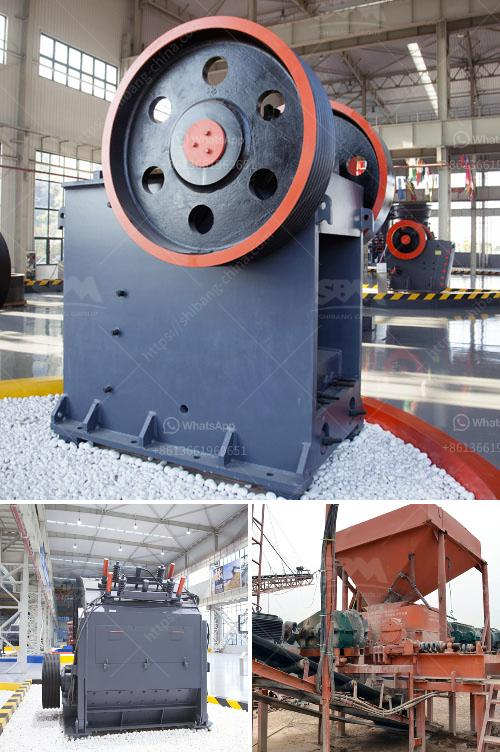

<h3>long distance conveyor of lafarge cement in bangladesh</h3>
Lafarge, a global leader in building materials, has revolutionized cement transportation in Bangladesh with its groundbreaking long-distance conveyor system. The seamless integration of technology and innovation has not only enhanced Lafarge's operational efficiency but has also positively impacted the country's infrastructure development. This article explores the significance of the long-distance conveyor system and its contribution to Lafarge's cement-transportation capabilities in Bangladesh.

Lafarge Bangladesh's long-distance conveyor system spans across kilometers, connecting its cement manufacturing plant to multiple distribution centers across the country. This innovative solution has eliminated the need for traditional trucking, reducing carbon emissions and traffic congestion while improving transport efficiency. The conveyor system operates tirelessly, ensuring a continuous flow of cement, reducing downtime, and meeting the ever-increasing demand for construction materials in Bangladesh.

By replacing trucks with conveyor belts, Lafarge has significantly reduced transportation costs. The system's automation allows for consistent and efficient transport of cement, eliminating human errors and delays caused by traffic or mechanical issues. The long-distance conveyor system ensures a constant supply of cement to distribution centers, enabling Lafarge to meet customer demand effectively. This improved productivity and delivery speed contribute to increased customer satisfaction and strengthen Lafarge's position as a reliable cement manufacturer in Bangladesh.

The long-distance conveyor system has positively impacted infrastructure development in Bangladesh. With cement being a key building material, the efficient and seamless transportation of Lafarge's product ensures a steady supply for various construction projects across the country. By facilitating rapid and reliable cement distribution, the conveyor system plays a crucial role in accelerating infrastructure development in remote areas, which were previously underserved by traditional transportation methods. This enhanced accessibility promotes economic growth, creates more job opportunities, and contributes to the overall improvement of living standards in the region.

Lafarge Bangladesh's adoption of a long-distance conveyor system has revolutionized cement transportation in the country. The integration of advanced technology and innovation has resulted in improved transport efficiency, reduced costs, and enhanced sustainability. The system's impact on infrastructure development cannot be understated, as it ensures a reliable supply of cement, perfect for supporting the growing construction industry in Bangladesh. Lafarge's long-distance conveyor system sets a benchmark for other cement manufacturers and provides a prime example of how technology can significantly enhance operations, productivity, and sustainability.
<h3>Contact us</h3><ul><li><strong>Whatsapp:&nbsp;<a href="https://wa.me/8613661969651">+8613661969651</a></strong></li><li><a href="https://swt.shibang-china.com/?git&amp;zhl&amp;long distance conveyor of lafarge cement in bangladesh"><strong>Online Service(chat now)</strong></a></li></ul><h3>Related</h3><ul><li><a href='ball mill for mineral grinding india.md'>ball mill for mineral grinding india</a></li><li><a href='mobile crusher price list.md'>mobile crusher price list</a></li><li><a href='quarry plant equipments and costs.md'>quarry plant equipments and costs</a></li><li><a href='copper ore processing plant in philippines.md'>copper ore processing plant in philippines</a></li><li><a href='mobile crusher manufacturers.md'>mobile crusher manufacturers</a></li></ul>