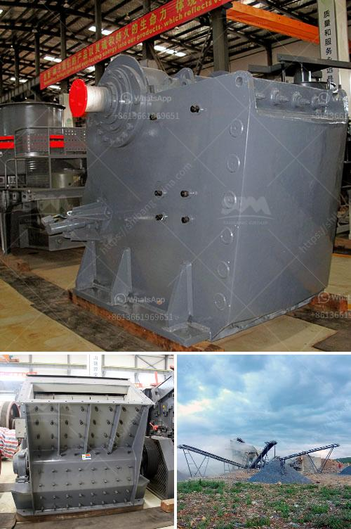

<h3>m sand manufacturers in india</h3>
M sand, also known as manufactured sand, is a type of sand processed to meet specific requirements of construction industry. It is manufactured by crushing granite rocks into fine grains and then classified to obtain a consistent particle size distribution. 

In recent years, the demand for M sand has significantly increased in India due to the shortage of natural sand, environmental concerns, and the need for high-quality sand for construction purposes. This has led to the growth of M sand manufacturers in the country.

India boasts an abundant supply of granite, which makes it an ideal source for manufacturing M sand. The southern states of Tamil Nadu, Karnataka, and Andhra Pradesh are considered the major M sand manufacturing hubs in the country. These states have numerous M sand manufacturers who utilize advanced technology and machinery to produce high-quality sand that meets the specifications of various construction projects.

These M sand manufacturers follow a strict process to ensure the quality of the sand. The raw material is sourced from licensed quarries and undergoes several stages of crushing, washing, and grading to eliminate impurities and obtain the desired particle size. The entire process is conducted under controlled conditions to maintain consistency and produce sand that meets the required standards.

One of the advantages of M sand is its superior quality compared to natural sand. It has consistent particle size, low silt content, and high strength, making it a reliable and cost-effective alternative for construction purposes. M sand is extensively used in concrete production, plastering, and as a substitute for river sand in construction activities.

The rising popularity of M sand in the construction industry has also led to the establishment of M sand testing laboratories in India. These laboratories conduct thorough testing to ensure that the sand meets the required specifications and is safe for use in construction projects.

With the increasing demand for M sand in the country, the M sand manufacturers in India are playing a crucial role in providing a sustainable solution to sand scarcity. They are committed to producing high-quality sand that meets the stringent requirements of the construction industry. By utilizing advanced technology and adhering to strict quality control measures, these manufacturers are contributing to the growth and development of the construction sector in India.
<h3>Contact us</h3><ul><li><strong>Whatsapp:&nbsp;<a href="https://wa.me/8613661969651">+8613661969651</a></strong></li><li><a href="https://swt.shibang-china.com/?git&amp;zhl&amp;m sand manufacturers in india"><strong>Online Service(chat now)</strong></a></li></ul><h3>Related</h3><ul><li><a href='quarry business in nigeria.md'>quarry business in nigeria</a></li><li><a href='gold crusher equipment.md'>gold crusher equipment</a></li><li><a href='stone crushers for sale in uk.md'>stone crushers for sale in uk</a></li><li><a href='clay powder machine.md'>clay powder machine</a></li><li><a href='bauxite calcination plant cost in india.md'>bauxite calcination plant cost in india</a></li></ul>