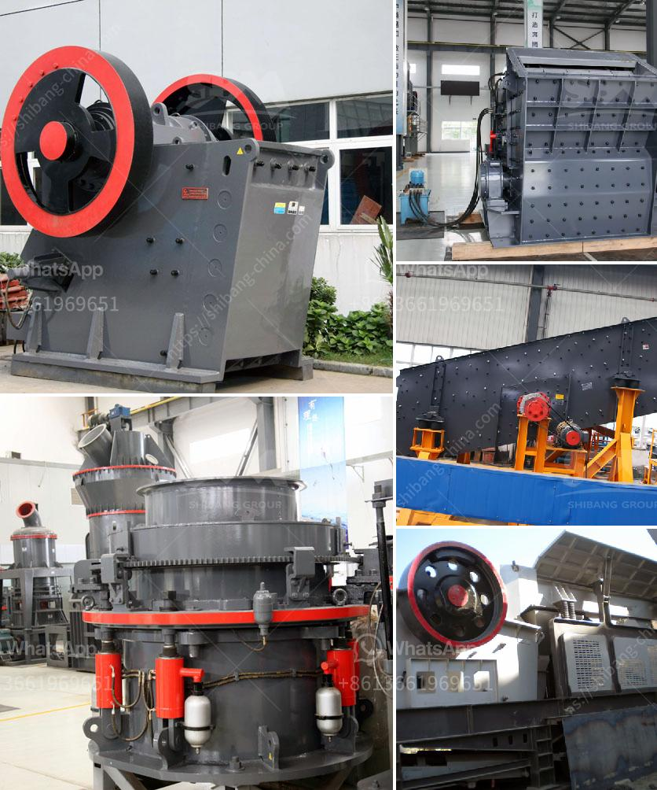

<h3>machine cost for cement production plant machine</h3>
The cement industry is known for its heavy machinery and large-scale production processes. To set up a cement production plant, a considerable investment is required to purchase highly efficient machinery and equipment. The cost of these machines can vary depending on factors such as the size of the plant, the production capacity, and the specific requirements of the project.

One of the key machines needed for a cement production plant is the crusher machine. This machine is responsible for crushing the raw materials into smaller pieces, which will then be transported to the kiln for further processing. The cost of a crusher machine can range from thousands to millions of dollars, depending on the capacity and specifications of the machine.

The next important machine in the production process is the kiln. The kiln is a large cylindrical furnace where the raw materials are heated to high temperatures to produce clinker, the main component of cement. The cost of a kiln can be significant, as it involves complex engineering and requires specialized materials to withstand high temperatures and maintain efficient operations.

Another crucial machine in a cement production plant is the grinding mill. This machine grinds the clinker into a fine powder, which is then mixed with gypsum and other additives to produce cement. The cost of a grinding mill can vary greatly depending on the size and capacity of the machine. Smaller mills suitable for small-scale production plants may cost a few hundred thousand dollars, while larger mills used in larger plants can cost millions of dollars.

Apart from these main machines, a cement production plant also requires various auxiliary equipment, such as conveyors, dust collectors, and storage silos, among others. These machines are necessary for the smooth and efficient operation of the plant, and their cost should be considered when planning a cement plant.

In addition to the initial investment in these machines, one must also consider the cost of maintenance and repairs. The heavy machinery used in cement production plants requires regular maintenance and occasional repairs to ensure optimum performance and prevent downtime. It is important to allocate a budget for ongoing maintenance and factor in the potential costs of repairs when considering the overall cost of a cement production plant.

Finally, it is worth noting that the cost of machines for a cement production plant can vary depending on the geographic location and the specific market conditions. Prices of raw materials, labor costs, and import/export regulations can all influence the final cost of the machines. Therefore, it is essential to conduct thorough research and consult with experts in the industry to accurately estimate the cost of the machines for a cement production plant.

In conclusion, setting up a cement production plant requires a significant investment in machinery and equipment. The cost of these machines can vary greatly depending on factors such as plant size, production capacity, and project requirements. It is important to carefully consider all aspects involved in the purchase, maintenance, and operation of these machines to ensure a successful and profitable cement production plant.
<h3>Contact us</h3><ul><li><strong>Whatsapp:&nbsp;<a href="https://wa.me/8613661969651">+8613661969651</a></strong></li><li><a href="https://swt.shibang-china.com/?git&amp;zhl&amp;machine cost for cement production plant machine"><strong>Online Service(chat now)</strong></a></li></ul><h3>Related</h3><ul><li><a href='stone crusher output.md'>stone crusher output</a></li><li><a href='buy mobile crusher in usa.md'>buy mobile crusher in usa</a></li><li><a href='quarry business in nigeria.md'>quarry business in nigeria</a></li><li><a href='how much price of ball mill.md'>how much price of ball mill</a></li><li><a href='used mobile jaw crushers for sale in uae.md'>used mobile jaw crushers for sale in uae</a></li></ul>