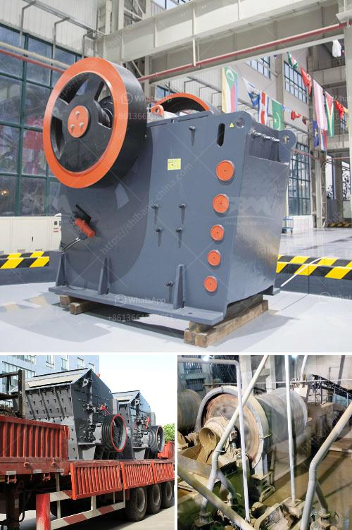

<h3>machine that crushes stones to ballast</h3>
As the world continues to expand and develop, the demand for railways, roads, and buildings is relentlessly increasing. To create sturdy foundations and ensure the safety of transportation networks, specially-engineered materials like ballast are crucial. Converting large stones into ballast has become a fundamental process, accomplished by a remarkable machine capable of crushing rocks with efficiency and precision.

The stone crushing machine used to crush rocks into ballast is called a ballast crusher. It is generally composed of various heavy-duty steel plates with different specifications and models. The equipment is mainly composed of a flywheel, a counterweight, a side guard plate, and a frame.

To process rocks into ballast, the machine utilizes a fixed jaw plate and a movable jaw plate. In the crushing chamber, the stones are trapped between the two plates. As the movable jaw plate moves back and forth, it crushes the rocks into smaller pieces.

Ballast is essential in various construction projects, particularly for railways. It acts as a stable and load-bearing foundation for the tracks, preventing any lateral movement. Ballast also provides direct support to the sleepers, which hold the rails in place, ensuring proper alignment and reducing the risk of derailment.

Moreover, ballast enhances drainage by allowing water to flow freely. This prevents water accumulation, which can lead to softening of the ground and subsequent track failure. Ballast also helps distribute the weight of trains evenly, reducing stress on tracks and providing a smoother and safer ride.

The stone crushing machine that crushes stones into ballast offers numerous advantages for the construction industry. Firstly, it eliminates the need for manual labor, reducing costs and ensuring faster project completion. Manual crushing of stones is time-consuming and labor-intensive, while the machine can swiftly crush stones into uniform ballast with minimal effort.

Secondly, the machine can precisely control the size and shape of the crushed stones. This ensures that the ballast meets the required specifications needed for different construction purposes. The uniformity and consistency of the crushed stones provide better stability and durability to the construction projects.

The stone crushing machine designed to transform rocks into essential ballast plays a critical role in the construction industry. The machine efficiently and precisely crushes stones of various sizes into perfectly shaped ballast, which is vital for building robust transportation networks, including railways, roads, and buildings. The benefits of using this machine are immense, ranging from increased productivity, reduced costs, and improved safety to better control over the quality of the ballast.

As the world continues to evolve, the demand for well-built infrastructure will only grow. Manufacturing ballast using this efficient and reliable stone crushing machine will remain an essential process for many construction projects, ensuring the safety, stability, and longevity of various transportation networks.
<h3>Contact us</h3><ul><li><strong>Whatsapp:&nbsp;<a href="https://wa.me/8613661969651">+8613661969651</a></strong></li><li><a href="https://swt.shibang-china.com/?git&amp;zhl&amp;machine that crushes stones to ballast"><strong>Online Service(chat now)</strong></a></li></ul><h3>Related</h3><ul><li><a href='hammer mill machinery in namibia.md'>hammer mill machinery in namibia</a></li><li><a href='gold mill for sale in zimbabwe.md'>gold mill for sale in zimbabwe</a></li><li><a href='crushing service with peru jaw crusher.md'>crushing service with peru jaw crusher</a></li><li><a href='how to set up a quarry plant.md'>how to set up a quarry plant</a></li><li><a href='south africa coal mining cost per ton.md'>south africa coal mining cost per ton</a></li></ul>