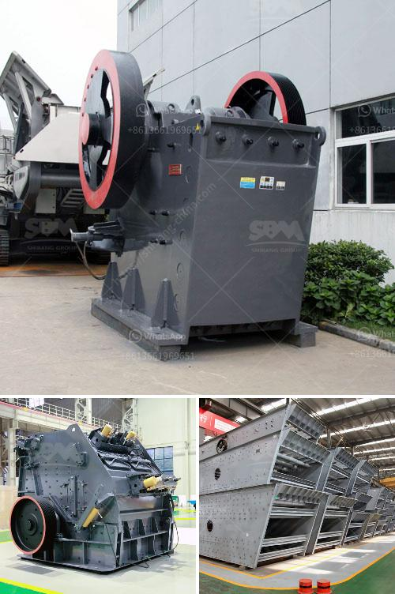

<h3>machinery used in cement factory</h3>
The industrial sector is a major driver of economic growth and development. In particular, the construction industry plays a crucial role in infrastructure development and building activities. Cement is an essential component in the construction sector, and cement factories are responsible for producing this vital material. These factories are equipped with various machinery and equipment that enable efficient and precise cement production.

One of the primary machines used in cement factories is the crusher. This machine crushes the limestone, which is the main constituent of cement, into smaller particles suitable for further processing. Most crushers operate in an open circuit, where the crushed limestone passes through a series of screens to separate it into specific sizes. These sizes are crucial for the desired composition and quality of the cement produced.

Another important machinery in cement factories is the raw mill. Raw materials, such as limestone, clay, and iron ore, are ground and homogenized into a fine powder before entering the kiln for the clinker production process. The raw mill operates with the use of rotating rollers and a table, crushed raw materials are fed into the mill and are ground and dried by hot gases flowing through the mill.

The kiln is the center of cement production in a cement factory. This large, cylindrical, and heated chamber is where chemical reactions occur, transforming the raw materials into clinker. The kiln operates at high temperatures (approximately 1,400°C to 1,500°C) and is typically fueled by coal, oil, or natural gas. The high temperatures within the kiln cause chemical reactions called decarbonation and sintering, resulting in the production of clinker. Various types of kilns, including the traditional vertical kiln and the more modern rotary kiln, are used in cement factories.

After the clinker is produced in the kiln, it is then ground into a fine powder using a cement mill. This machine contains steel balls or other grinding media that rotate within the mill, causing the clinker to be ground into a fine powder. Gypsum is usually added during this grinding process to regulate the setting time of the cement.

In addition to the above-mentioned machinery, cement factories are equipped with various auxiliary equipment to support the production process. These include conveyors, which transport raw materials and finished products; dust collectors, which capture and filter out dust generated during the production process to maintain air quality; and packaging machines, which package the final cement product into bags or bulk containers ready for distribution.

In recent years, advancements in technology have resulted in the development of more efficient machinery for cement factories. For example, computerized systems and automation have improved the operation and control of these machines, leading to increased productivity and cost-effectiveness. Additionally, there has been a focus on environmental sustainability, with new machinery designed to reduce emissions and improve energy efficiency.

In conclusion, cement factories rely on a range of machinery and equipment to produce cement. Crushers, raw mills, kilns, and cement mills are key machines in this process. Additionally, auxiliary equipment supports the production process, such as conveyors, dust collectors, and packaging machines. Technological advancements have improved the efficiency and sustainability of these machines, ensuring the continued supply of high-quality cement for the construction industry.
<h3>Contact us</h3><ul><li><strong>Whatsapp:&nbsp;<a href="https://wa.me/8613661969651">+8613661969651</a></strong></li><li><a href="https://swt.shibang-china.com/?git&amp;zhl&amp;machinery used in cement factory"><strong>Online Service(chat now)</strong></a></li></ul><h3>Related</h3><ul><li><a href='cost of roller crusher.md'>cost of roller crusher</a></li><li><a href='used mobile jaw crusher dealers in ghana.md'>used mobile jaw crusher dealers in ghana</a></li><li><a href='coal crushing and screening plant for sale.md'>coal crushing and screening plant for sale</a></li><li><a href='uk quarry crusher machinery manufacturers.md'>uk quarry crusher machinery manufacturers</a></li><li><a href='stone crusher permission maharashtra.md'>stone crusher permission maharashtra</a></li></ul>