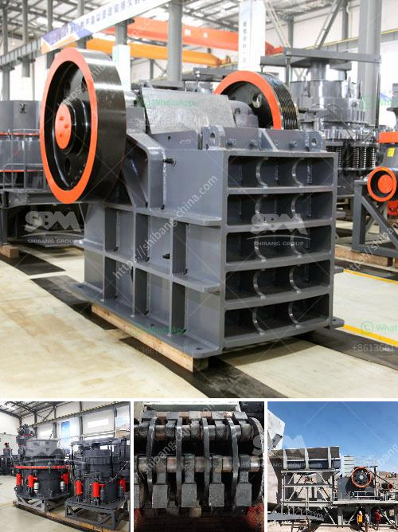

<h3>magnetic separator for iron sand</h3>
Iron sand, also known as iron ore sand or simply sand, is composed mainly of magnetite, a mineral that contains iron oxide. It is particularly valuable due to its high iron content and is commonly used in the production of steel. However, before it can be used for industrial applications, it needs to undergo a refining process to remove impurities, such as iron impurities present in the sand.

One effective solution to remove these impurities is a magnetic separator. A magnetic separator for iron sand is a machine that utilizes magnetism to separate iron particles from a mixture of sand and other substances. It is commonly used in industries such as mining, paper mills, steel mills, and recycling plants where iron impurities are prevalent.

The process of using a magnetic separator starts with feeding the mixture of sand and other substances onto a conveyor belt. As the mixture moves along, powerful magnets underneath the conveyor belt generate a magnetic field. The magnetic field attracts and holds onto the iron particles while allowing the clean sand and other substances to continue moving forward.

One of the key advantages of using a magnetic separator for iron sand is its ability to produce high-quality iron concentrate. The powerful magnetic field generated by the machine ensures efficient separation of the iron particles from the rest of the mixture. Consequently, the resulting iron concentrate is of high purity, making it suitable for various industrial applications.

Another benefit of using a magnetic separator is its versatility. The machine can be adjusted to accommodate different types of iron-containing substances, ensuring optimal performance in various industries. Whether the iron impurities are in the form of fine particles or larger chunks, a magnetic separator can effectively remove them, improving the overall quality of the final product.

Furthermore, a magnetic separator offers a cost-effective solution for iron sand separation. It requires minimal maintenance and consumes relatively low energy, making it an economical option for businesses. Additionally, using a magnetic separator helps reduce the reliance on manual labor, leading to increased productivity and efficiency in the production process.

While magnetic separators are highly effective in separating iron particles, they may not be suitable for all applications. The size and composition of the mixture being processed, as well as the desired purity of the final product, should be considered when determining whether a magnetic separator is the right choice.

In conclusion, a magnetic separator for iron sand is a valuable tool in the processing of iron-containing substances. It efficiently separates iron particles from sand and other materials, resulting in high-quality iron concentrate. With its versatility, cost-effectiveness, and ability to improve productivity, magnetic separators play a crucial role in various industries where iron impurities are a concern.
<h3>Contact us</h3><ul><li><strong>Whatsapp:&nbsp;<a href="https://wa.me/8613661969651">+8613661969651</a></strong></li><li><a href="https://swt.shibang-china.com/?git&amp;zhl&amp;magnetic separator for iron sand"><strong>Online Service(chat now)</strong></a></li></ul><h3>Related</h3><ul><li><a href='300tpd sponge iron machinery cost.md'>300tpd sponge iron machinery cost</a></li><li><a href='aggregate conveyor systems.md'>aggregate conveyor systems</a></li><li><a href='stone crushers for sale.md'>stone crushers for sale</a></li><li><a href='stone crusher output.md'>stone crusher output</a></li><li><a href='mini mill 12x20 jaw crusher.md'>mini mill 12x20 jaw crusher</a></li></ul>