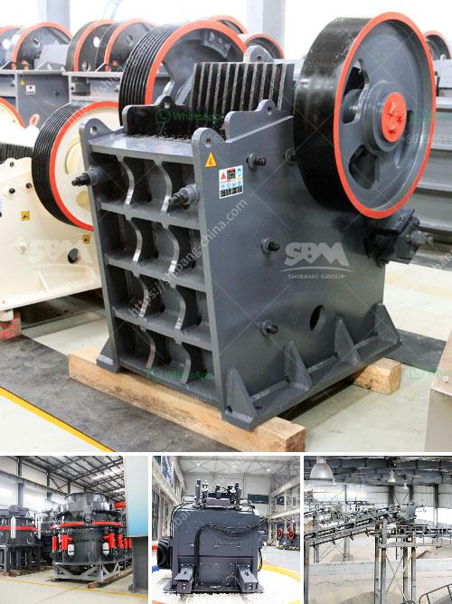

<h3>malaysia coconut grinder machine</h3>
Coconut is an essential ingredient in Malaysian cuisine and a staple in many traditional dishes. From coconut milk to coconut flakes, this versatile fruit offers a unique flavor and texture that enhances the taste of various culinary delights. However, extracting the white, fleshy meat from the hard shell is often a labor-intensive process that requires skill and precision. This is where the Malaysia coconut grinder machine comes into play, making the task of grating coconuts a breeze.

The Malaysia coconut grinder machine is a revolutionary innovation that enables coconut enthusiasts to extract the meat effortlessly. Traditionally, this task was done manually using a sharp knife or a metal scraper to remove the coconut flesh from the shell. However, this method is time-consuming, tedious, and requires a great deal of effort. With the coconut grinder machine, users can now enjoy fresh coconut meat in a matter of minutes.

One of the key features of the Malaysia coconut grinder machine is its user-friendly design. Unlike the traditional methods, this machine does not require any special skills or knowledge to operate. Simply place the de-husked coconut on the machine and let it work its magic. The automated process quickly grates the coconut, separating the meat from the shell with minimal effort. This allows users to save time and energy, especially when dealing with large quantities of coconuts.

Another notable advantage of the Malaysia coconut grinder machine is its versatility. It comes with different attachments and settings that enable users to obtain various textures of coconut meat. Whether one prefers fine or coarse coconut flakes, this machine can deliver the desired outcome. The adjustable settings cater to individual preferences, making it ideal for both professional chefs and everyday kitchen enthusiasts.

Moreover, the Malaysia coconut grinder machine is not limited to grating coconuts alone. Its powerful motor and sharp blades can also be used to grind other ingredients like spices and nuts. This multi-functional feature adds value to the machine, allowing users to explore different recipes and experiment with flavors. From coconut chutneys to granola bars, the possibilities are endless with this handy kitchen tool.

Furthermore, the Malaysia coconut grinder machine is built to last. Made from durable materials, it is designed to withstand regular use and maintain its functionality for years to come. This makes it a worthy investment for both households and businesses in the food industry. The machine is also easy to clean, with detachable parts that can be washed separately, ensuring hygiene and preventing cross-contamination.

In conclusion, the Malaysia coconut grinder machine is a game-changer for coconut lovers. It simplifies the process of extracting coconut meat, making it a hassle-free experience. Its user-friendly design, versatility, and durability make it an essential kitchen tool for both professionals and home cooks. From coconut milk to coconut flakes, this machine opens up a world of possibilities, allowing individuals to explore diverse recipes and savor the unique flavors of Malaysian cuisine. So, if you're a coconut enthusiast, the Malaysia coconut grinder machine is a must-have addition to your kitchen arsenal.
<h3>Contact us</h3><ul><li><strong>Whatsapp:&nbsp;<a href="https://wa.me/8613661969651">+8613661969651</a></strong></li><li><a href="https://swt.shibang-china.com/?git&amp;zhl&amp;malaysia coconut grinder machine"><strong>Online Service(chat now)</strong></a></li></ul><h3>Related</h3><ul><li><a href='sample contract mining agreement.md'>sample contract mining agreement</a></li><li><a href='small scale quarry stone making machine.md'>small scale quarry stone making machine</a></li><li><a href='malaysia hammer mills.md'>malaysia hammer mills</a></li><li><a href='crusher jaw crusher 16x8.md'>crusher jaw crusher 16x8</a></li><li><a href='mini mill 12x20 jaw crusher.md'>mini mill 12x20 jaw crusher</a></li></ul>