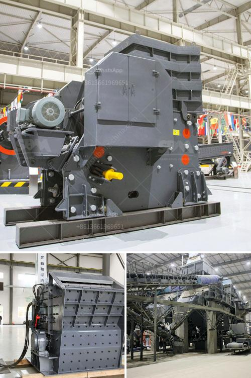

<h3>malaysia hammer mills</h3>
Hammer mills are modern-day industrial grinding machines that are used for a variety of grinding applications. In Malaysia, hammer mills are primarily utilized in the agricultural sector to shred crops into smaller particles, making it easier for further processing. They are also extensively used in the manufacturing and recycling industries to reduce the size of materials and facilitate their reuse. With their versatility and efficiency, hammer mills have become a prominent solution in Malaysia and have gained widespread popularity.

One of the key reasons for the success of hammer mills in Malaysia is their ability to handle a wide range of materials. From agricultural products such as grains, maize, and rice, to industrial materials like sawdust, wood chips, and plastics, hammer mills can efficiently process these materials to meet the specific requirements of various industries. This flexibility makes them an essential asset for farmers, as they can easily convert crops into finer powders or pellets for animal feed, ensuring optimum nutrition for livestock.

In addition to their versatility, hammer mills are known for their exceptional grinding capabilities. The design of the hammers and the rotating speed of the rotor allows for efficient pulverization of materials, resulting in a uniform and consistent particle size. This fine grinding ability is crucial for industries that require precise particle sizes, such as the food and pharmaceutical sectors. Hammer mills enable manufacturers to create powders or granules of the desired size, ensuring high-quality end products.

Furthermore, hammer mills are also highly efficient machines. With their powerful motors and high rotation speeds, they can process large quantities of materials in a short span of time. This efficiency is beneficial for industries that operate on a large scale, where time and productivity are crucial factors. In Malaysia, industries such as feed mills, sawmills, and plastic recycling plants rely on hammer mills to streamline their operations and improve productivity while reducing operational costs.

Moreover, hammer mills offer several additional advantages. They are relatively easy to maintain and operate, requiring minimal effort and expertise. The screens used in hammer mills are easily replaceable, allowing for quick adjustments and the production of different-sized particles. This adaptability enables manufacturers to cater to the specific needs of their customers, making hammer mills a valuable tool in the market.

In conclusion, Malaysia hammer mills have become a prominent solution for grinding applications across various industries. Their versatility, exceptional grinding capabilities, and high efficiency make them an indispensable asset for farmers, manufacturers, and recyclers alike. With the ability to handle a wide range of materials and produce desired particle sizes, hammer mills have cemented their position as reliable and cost-effective grinding machines. As Malaysia continues to strive for agricultural and industrial advancement, the demand for hammer mills is expected to increase, making them a significant player in the country's grinding machinery industry.
<h3>Contact us</h3><ul><li><strong>Whatsapp:&nbsp;<a href="https://wa.me/8613661969651">+8613661969651</a></strong></li><li><a href="https://swt.shibang-china.com/?git&amp;zhl&amp;malaysia hammer mills"><strong>Online Service(chat now)</strong></a></li></ul><h3>Related</h3><ul><li><a href='sand powder milling machine.md'>sand powder milling machine</a></li><li><a href='conveyor belt capacity.md'>conveyor belt capacity</a></li><li><a href='ball mill inside.md'>ball mill inside</a></li><li><a href='processing of copper crusher in zambia.md'>processing of copper crusher in zambia</a></li><li><a href='stone aggregate crusher.md'>stone aggregate crusher</a></li></ul>