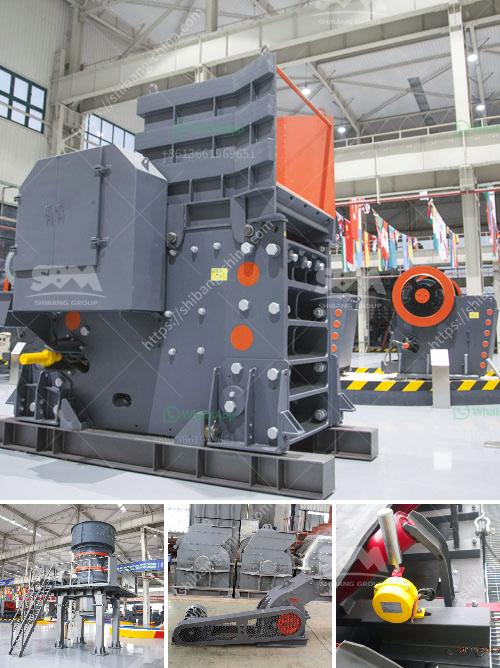

<h3>manganese ore beneficiation plant china</h3>
Manganese ore beneficiation plant plays an important role in enriching manganese ore, and Fote has a professional team to design and construct the manganese ore beneficiation plant. China is rich in manganese ore resources, and there are more than 70 known manganese-containing minerals. Among them, manganese oxide ore and manganese carbonate ore are important industrial materials used in the metallurgical industry, chemical industry, light industry, construction industry, national defense, and electronics industry. Manganese ore can be directly used in the steel industry because of its rich reserves and high economic value.

China is the world's largest producer and consumer of manganese, and it accounts for about 30% of the global manganese reserves. However, most manganese ores belong to low-grade ores, which must be treated by beneficiation methods to obtain higher-grade manganese ore products. China's manganese ore beneficiation plants mainly include gravity separation, magnetic separation, and floatation separation.

Gravity separation relies on the difference in specific gravity between manganese ore and associated gangue materials to separate them. This method has the advantages of simple process, low investment cost, and low production cost; however, it also has the disadvantages of large water consumption, high energy consumption, and low metal recovery rate. Gravity separation is suitable for the treatment of medium and fine-grained manganese oxide ore.

Magnetic separation uses the magnetic properties of manganese ore minerals to separate them from gangue minerals. The magnetic separation process has the advantages of simple process, low investment cost, and high recovery rate; however, it is difficult to recover fine-grained manganese ore particles, and the magnetic separation equipment requires high magnetic field strength and economic cost. Magnetic separation is suitable for the treatment of medium and coarse-grained manganese oxide ore and manganese carbonate ore.

Floatation separation is based on the difference in surface wettability of manganese ore and gangue minerals to separate them. This method has the advantages of high recovery rate, large processing capacity, and low production cost; however, it also has the disadvantages of complex process, difficult control, and environmental pollution. Floatation separation is mainly used for the treatment of fine-grained manganese oxide ore.

In recent years, China's manganese ore beneficiation plants have developed rapidly, and the number and scale of plants have gradually increased. Fote Machinery is a large-scale manganese ore beneficiation plant designer and manufacturer. The company produces manganese ore beneficiation plant equipment including crushers, vibrating screen, sand washing machines, and conveyors. Fote Machinery can design manganese ore beneficiation plant flow chart according to customers' requirements and the specific ore conditions. Fote Machinery can provide manganese ore beneficiation plant machines for customers on the whole process, including project design, equipment selection, and installation & commissioning. Fote Machinery is committed to providing customers with perfect mineral processing equipment and solutions.
<h3>Contact us</h3><ul><li><strong>Whatsapp:&nbsp;<a href="https://wa.me/8613661969651">+8613661969651</a></strong></li><li><a href="https://swt.shibang-china.com/?git&amp;zhl&amp;manganese ore beneficiation plant china"><strong>Online Service(chat now)</strong></a></li></ul><h3>Related</h3><ul><li><a href='south africa second hand mobile stone crusher.md'>south africa second hand mobile stone crusher</a></li><li><a href='crushed stone sorting machinery.md'>crushed stone sorting machinery</a></li><li><a href='secondary impact crusher.md'>secondary impact crusher</a></li><li><a href='chart of accounts for cement factory.md'>chart of accounts for cement factory</a></li><li><a href='copper processing plant.md'>copper processing plant</a></li></ul>