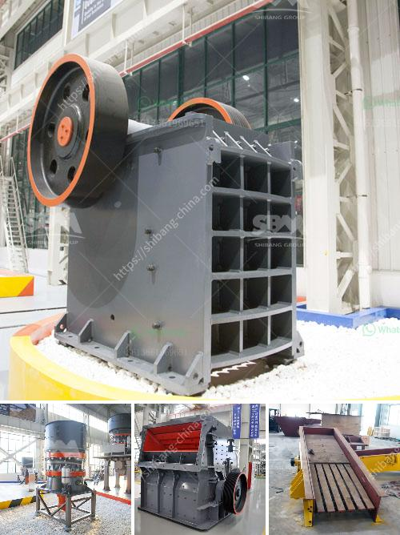

<h3>mantencion a cone crusher</h3>
Cone crushers are used in various industries and are essential for producing crushed materials. However, regular maintenance is crucial to ensuring their optimal performance and longevity. Here are a few maintenance tips to help you maintain your cone crusher and keep it in good condition.

1. Regularly inspect and clean the machine: Before starting any maintenance work, it is important to inspect the cone crusher thoroughly. Check for any signs of wear or damage, such as cracks or loose parts. Additionally, clean the machine regularly to remove any dust, debris, or build-up that may affect its performance.

2. Lubricate the bearings: Cone crushers have many moving parts, including the bearings that hold the shaft. Proper lubrication of these bearings is essential to prevent friction and premature wear. Use the manufacturer's recommended lubricant and ensure that the bearings are adequately lubricated at all times. Regularly check the oil levels and replace it if necessary.

3. Check the belts and pulleys: The belts and pulleys in a cone crusher play a crucial role in transmitting power from the motor to the crushing chamber. Regularly inspect these components for signs of wear, cracks, or misalignment. Replace any damaged belts or pulleys promptly to prevent further damage to the machine.

4. Monitor the crusher's operating conditions: Pay attention to the temperature, pressure, and power draw of the cone crusher during operation. High temperatures or pressures may indicate issues with the cooling system or excessive load on the machine. If any abnormal readings are observed, contact a professional technician to diagnose and resolve the problem.

5. Maintain a consistent feed rate: Cone crushers are designed to operate with a consistent and controlled feed rate. Irregular or fluctuating feed can cause uneven wear on the crushing chamber and result in poor performance. Use a feeder with adjustable speed controls to maintain a steady flow of material into the crusher.

6. Replace worn-out parts: Over time, the wear and tear on cone crusher components can lead to decreased performance and increased downtime. Regularly inspect and replace any worn-out parts, such as liners, mantles, or wear rings. Using genuine manufacturer parts is essential to ensure proper fit and optimal performance.

7. Train your operators: Proper operation of a cone crusher is crucial for its longevity and performance. Train your operators on the correct procedures for starting, stopping, and operating the machine. Stress the importance of regular maintenance and encourage them to report any issues promptly to prevent further damage.

In conclusion, regular maintenance is imperative to ensure the smooth operation and longevity of a cone crusher. By following these maintenance tips, you can prevent unnecessary downtime, increase productivity, and extend the life of your cone crusher. Remember, a well-maintained cone crusher is a cost-effective investment that will provide years of reliable service.
<h3>Contact us</h3><ul><li><strong>Whatsapp:&nbsp;<a href="https://wa.me/8613661969651">+8613661969651</a></strong></li><li><a href="https://swt.shibang-china.com/?git&amp;zhl&amp;mantencion a cone crusher"><strong>Online Service(chat now)</strong></a></li></ul><h3>Related</h3><ul><li><a href='high purity quartz crusher processing.md'>high purity quartz crusher processing</a></li><li><a href='marble crusher plant in india.md'>marble crusher plant in india</a></li><li><a href='process of gypsum board manufacturing.md'>process of gypsum board manufacturing</a></li><li><a href='grinding mills supplier in gujraanwala.md'>grinding mills supplier in gujraanwala</a></li><li><a href='south africa second hand mobile stone crusher.md'>south africa second hand mobile stone crusher</a></li></ul>