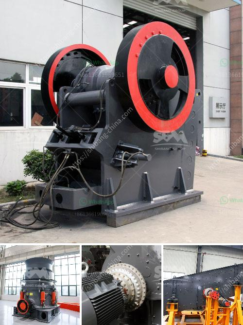

<h3>manual stone crusher in kenya</h3>
Stone crushing industry is currently on the upward trajectory in Kenya with tremendous growth being witnessed in the construction industry. The demand for crushed stones is continuously expanding and this is attributed to factors such as population growth, increase in urbanization, and infrastructure development among others.

In Kenya, there are various types of manual stone crusher machines in the market. With different working principles, there are jaw crushers, impact crushers, cone crushers, hammer crushers, etc. Each type possesses various functions as well as different features. These machines can work standalone or be combined with other machines to create a flexible stone crushing production line.

The manual machine is cheap and affordable as compared to the automated stone crusher machines. This makes it economical and ensures that more stones are crushed at a slower pace manually. By considering the fact that manual machines are relatively slower, it allows the owners to have a small business venture. This slow pace of crushing stones ensures that they are crushed with maximum efficiency to produce the required items such as ballast, concrete, and aggregate.

The manual stone crushing process is quite labor-intensive and requires lots of workforce. It produces gravel and broken stones of various sizes for construction purposes. A manual stone crusher makes work more comfortable and simple compared to other crushers for an unskilled worker.

The output of a manual stone crusher is generally 20-40mm in size. It can be different types of stones such as granite, pebbles, limestone, basalt, stone, over iron, etc. Crushed stones are useful in various construction applications like buildings, highways, railways, tunnels, dams, and bridges etc. Before owning a stone crusher, it is essential to ensure that the person offering the service is licensed. This is a requirement because it helps assure clients that they are working with legitimate businesses and they can trust the quality of services offered.

To ensure the sustainability of the manual stone crushing venture, it is crucial to consider factors such as whether the machines will be sold once they are no longer useful or whether they will be used to crush stones for other clients after the project has been completed. This consideration will help in optimizing the utilization of the machines to earn maximum profits.

In conclusion, Kenya is experiencing tremendous growth in the construction industry, and manual stone crushing machines are ideal for reducing the cost of construction projects. They provide durable machines that can produce a wide range of stone sizes, and this is achieved through manual crushing. The machines are available in different options and are cheap to acquire and maintain. They are, therefore, suitable for small-scale entrepreneurs looking to venture into the stone crushing business.
<h3>Contact us</h3><ul><li><strong>Whatsapp:&nbsp;<a href="https://wa.me/8613661969651">+8613661969651</a></strong></li><li><a href="https://swt.shibang-china.com/?git&amp;zhl&amp;manual stone crusher in kenya"><strong>Online Service(chat now)</strong></a></li></ul><h3>Related</h3><ul><li><a href='sell stone crusher 2x4.md'>sell stone crusher 2x4</a></li><li><a href='jaw crusher agen surabaya.md'>jaw crusher agen surabaya</a></li><li><a href='second hand jaw pulverizer india.md'>second hand jaw pulverizer india</a></li><li><a href='stone crushers in bangalore.md'>stone crushers in bangalore</a></li><li><a href='limestone processing plant company.md'>limestone processing plant company</a></li></ul>