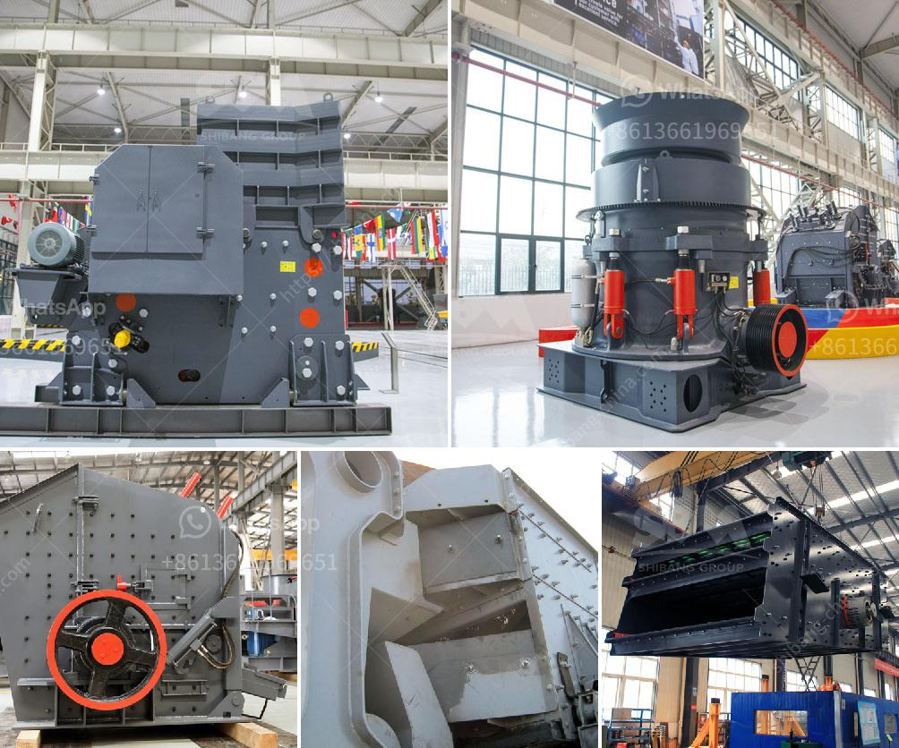

<h3>manufacturer of crushing plant malaysia</h3>
Crushing plant is a highly efficient and productive machine that helps in breaking and crushing large-sized rocks, stones, and other solid materials into smaller pieces. The manufacturer of crushing plant in Malaysia is a leading international provider of heavy machinery, equipment, and technology for the mining and construction industries. With thousands of units operating in mines and quarries around the world, they have the experience and expertise to deliver innovative and cost-effective solutions for their customers.

One of the key advantages of the crushing plant is its ability to process materials on-site. This eliminates the need to transport large pieces of raw material to a stationary plant, reducing transportation costs and overall project expenses. In addition, the crushing plant is also known for its versatility, as it can process a wide variety of materials, including limestone, granite, basalt, and river pebbles, to name a few.

The manufacturer of crushing plant in Malaysia has been in the industry for over 30 years, and they have a team of highly skilled engineers that are constantly researching new technologies to help improve the efficiency and effectiveness of their equipment. They understand the needs of their customers and work closely with them to develop customized solutions that meet their specific requirements.

The crushing plant is equipped with advanced control systems that allow operators to monitor and adjust various parameters, such as crusher settings, feed rates, and product gradation. This ensures consistent and high-quality output, while minimizing downtime and maximizing productivity. Additionally, the manufacturer provides comprehensive after-sales support, including training, technical assistance, and spare parts availability to ensure smooth operation and minimize disruptions.

In terms of environmental sustainability, the manufacturer of crushing plant in Malaysia is committed to reducing its carbon footprint and minimizing the impact on the environment. They have implemented various measures to optimize energy efficiency and reduce emissions, such as using energy-saving motors and incorporating dust suppression systems. They also prioritize the use of sustainable materials and recycling practices in their manufacturing processes.

The crushing plant is designed to be easy to operate and maintain, with user-friendly interfaces and accessible components. Routine maintenance and inspections can be carried out quickly and efficiently, minimizing downtime and ensuring maximum uptime. The manufacturer also offers comprehensive training programs for operators, allowing them to fully utilize the capabilities of the equipment and operate it safely.

In conclusion, the manufacturer of crushing plant in Malaysia is a reputable and reliable choice for contractors seeking high-quality equipment and efficient solutions. With their extensive experience and commitment to innovation, they continue to lead the industry in delivering advanced crushing and screening technology. Whether it is for mining operations, construction projects, or recycling applications, their crushing plant offers exceptional performance, durability, and versatility.
<h3>Contact us</h3><ul><li><strong>Whatsapp:&nbsp;<a href="https://wa.me/8613661969651">+8613661969651</a></strong></li><li><a href="https://swt.shibang-china.com/?git&amp;zhl&amp;manufacturer of crushing plant malaysia"><strong>Online Service(chat now)</strong></a></li></ul><h3>Related</h3><ul><li><a href='size maya size of a stone crusher.md'>size maya size of a stone crusher</a></li><li><a href='puzzolana crusher malaysia.md'>puzzolana crusher malaysia</a></li><li><a href='jaw crusher for sale in south africa.md'>jaw crusher for sale in south africa</a></li><li><a href='basalt impact crusher price.md'>basalt impact crusher price</a></li><li><a href='ball mill in kazakhstan.md'>ball mill in kazakhstan</a></li></ul>