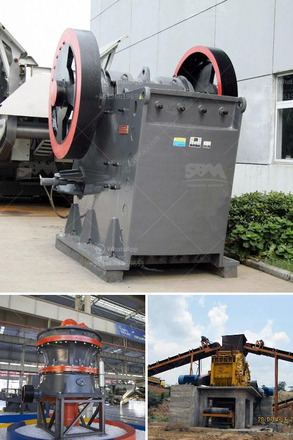

<h3>manufacturers hammer mill manufacturers in malaysia</h3>
Hammer mills are used to shred or crush materials into smaller pieces and are found in many different industries for various purposes. In Malaysia, there is a wide range of manufacturers of hammer mills. Some renowned manufacturers of these machines include Retsch, Hosokawa Alpine, Fluidpack, Fritsch, Skl Mineral Processing Equipment, and many more. These manufacturers have a great selection of hammer mills to choose from and offer competitive prices.

One notable manufacturer in Malaysia is Retsch. They have been in the business for over 100 years and have gained a reputation for producing high-quality machines. They offer a variety of hammer mills suitable for different applications, including pharmaceuticals, food processing, and mineral processing. Retsch hammer mills are known for their durability and efficiency, ensuring consistent and reliable results.

Hosokawa Alpine is another leading manufacturer of hammer mills in Malaysia. They are known for their state-of-the-art technology and high-quality equipment. Hosokawa Alpine hammer mills are designed to ensure optimal performance and minimal energy consumption, making them suitable for a wide range of applications, including chemicals, minerals, and plastics.

Fluidpack is a well-established manufacturer of hammer mills in Malaysia. They offer a range of hammer mills suitable for various sizes and capacities. Fluidpack's hammer mills are known for their reliability and efficiency, ensuring consistent particle size reduction. They also offer customization options to meet specific customer requirements.

Fritsch is a global manufacturer of hammer mills and other laboratory equipment. Their hammer mills are widely used in research institutions, universities, and factories worldwide. Fritsch hammer mills are known for their precision and high-quality construction, ensuring excellent performance and durability.

Skl Mineral Processing Equipment is a renowned manufacturer of hammer mills in Malaysia. They have been providing reliable and efficient solutions for the mineral processing industry for over 20 years. Skl Mineral Processing Equipment hammer mills are designed to meet the most demanding requirements and offer high performance and durability.

In conclusion, Malaysia offers a wide variety of hammer mill manufacturers that cater to different industries and applications. These manufacturers, including Retsch, Hosokawa Alpine, Fluidpack, Fritsch, and Skl Mineral Processing Equipment, offer a range of hammer mills with varying capacities and specifications. Whether it is for pharmaceuticals, food processing, minerals, or chemicals, customers can find the right hammer mill for their needs in Malaysia.
<h3>Contact us</h3><ul><li><strong>Whatsapp:&nbsp;<a href="https://wa.me/8613661969651">+8613661969651</a></strong></li><li><a href="https://swt.shibang-china.com/?git&amp;zhl&amp;manufacturers hammer mill manufacturers in malaysia"><strong>Online Service(chat now)</strong></a></li></ul><h3>Related</h3><ul><li><a href='gypsum powder dryer price pakistan.md'>gypsum powder dryer price pakistan</a></li><li><a href='quartz powder plant in india.md'>quartz powder plant in india</a></li><li><a href='feldspar stone processing plant.md'>feldspar stone processing plant</a></li><li><a href='broach grinding machine manufacture in china.md'>broach grinding machine manufacture in china</a></li><li><a href='costs for a stone crusher plant.md'>costs for a stone crusher plant</a></li></ul>