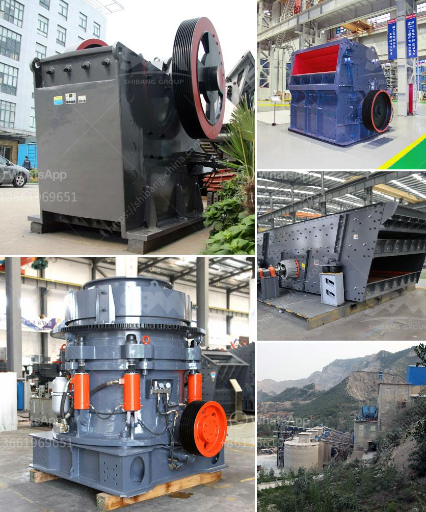

<h3>manufacturers of conveyor belts in mexico</h3>
Mexico is known for being a manufacturing powerhouse, producing a wide array of products across various industries. One essential component in many manufacturing processes is the conveyor belt, which helps streamline production and increase efficiency. In Mexico, there are several notable manufacturers of conveyor belts catering to the needs of diverse sectors.

One prominent manufacturer is Conveyor Belts Mexico. With decades of experience, they offer an extensive range of conveyor belts, catering to industries such as automotive, food processing, logistics, and more. Their commitment to producing high-quality belts is reinforced by their use of advanced technologies and adherence to strict quality control measures.

Another leading manufacturer is Servicio Industrial Mecanizado (SIMSA). They specialize in designing and manufacturing custom conveyor belts tailored to individual customer requirements. SIMSA's expertise lies in producing belts that can withstand harsh operating conditions while ensuring optimal performance in demanding applications.

Mexican manufacturing giant, Grupo Tubos y Perfiles (GTP), is also involved in the production of conveyor belts. Known for their expertise in metalworking, GTP manufactures conveyor belts predominantly used in the mining and construction industries. Their belts are highly durable, capable of handling heavy loads, and reliable, making them ideal for rugged environments.

Conveyor Belts de Mexico (CBM) is another notable manufacturer in the Mexican market. With a focus on providing innovative solutions, CBM produces a wide range of belts, including modular, spiral, and stainless-steel options. Their belts find applications in industries such as pharmaceuticals, logistics, and automotive.

These manufacturers, among others, demonstrate Mexico's commitment to becoming a key player in the conveyor belt industry. With their emphasis on quality, adaptability, and advanced production techniques, they contribute significantly to the local and global supply chains.

Mexico's strategic location, strong manufacturing capabilities, and access to global markets make it an attractive destination for the conveyor belt industry. Moreover, the country's continuous investment in infrastructure projects, such as airports, highways, and ports, further drives the demand for conveyor belts, creating opportunities for growth and innovation within the sector.

In conclusion, Mexico boasts several reputable manufacturers of conveyor belts, catering to diverse industries and requirements. With their focus on quality, customization, and advancements in technology, these manufacturers play a vital role in enhancing the efficiency and productivity of various manufacturing and logistics processes.
<h3>Contact us</h3><ul><li><strong>Whatsapp:&nbsp;<a href="https://wa.me/8613661969651">+8613661969651</a></strong></li><li><a href="https://swt.shibang-china.com/?git&amp;zhl&amp;manufacturers of conveyor belts in mexico"><strong>Online Service(chat now)</strong></a></li></ul><h3>Related</h3><ul><li><a href='process of granite mining crusher machines used.md'>process of granite mining crusher machines used</a></li><li><a href='coal crusher size 100 tph.md'>coal crusher size 100 tph</a></li><li><a href='iron crushing equipment for sale.md'>iron crushing equipment for sale</a></li><li><a href='stone jaw crusher machinery supplier.md'>stone jaw crusher machinery supplier</a></li><li><a href='roll grinders manufacturers.md'>roll grinders manufacturers</a></li></ul>