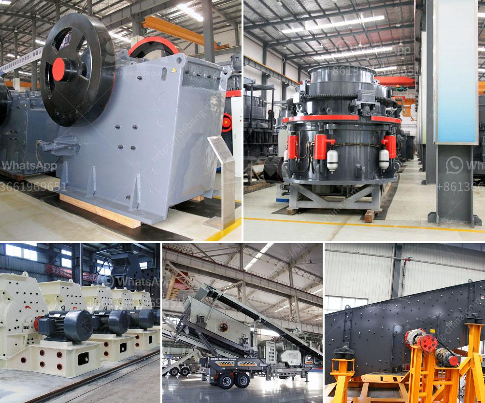

<h3>manufacturing proccess of aggregate</h3>
The manufacturing process of aggregate is a complex one that involves a variety of steps. These steps may vary depending on the material being produced, but generally, it involves the extraction, transportation, and processing of raw materials into the final product.

The first step in the manufacturing process is the extraction of raw materials. These materials can include rocks, sand, gravel, or other natural resources. The extraction process typically involves using heavy machinery such as bulldozers, excavators, and front-end loaders to remove the raw materials from the earth. The extracted materials are then transported to a processing plant.

Once at the processing plant, the raw materials are further processed to create the desired aggregate product. The processing may involve crushing, screening, and washing the raw materials to remove impurities and create a uniform product. Crushing involves the use of heavy industrial machinery to break down the raw materials into smaller pieces. Screening is then used to sort the crushed materials into different sizes.

Washing is an important step in the process as it helps to remove any remaining impurities and create a clean product. This is especially important if the aggregate is intended for use in construction projects where purity is crucial. After washing, the aggregate is further sorted into different sizes using vibrating screens.

Once the aggregate is processed and sorted, it is ready to be used in various applications. One common use of aggregate is in the construction industry. It is widely used as a base or subbase material for roads, highways, and other infrastructure projects. This is due to its strength, durability, and ability to provide a solid foundation.

In addition to construction, aggregate is also used in the manufacturing of concrete. Concrete is made by combining aggregate with cement, water, and other additives. The aggregate provides the bulk and strength to the concrete mixture, while the cement acts as the binding agent. This mixture is then poured into molds or forms to create various structures, such as buildings, bridges, and sidewalks.

Overall, the manufacturing process of aggregate requires careful extraction, transportation, and processing of raw materials. It involves the use of heavy machinery, such as crushers, screens, and washers, to transform the raw materials into a usable product. The final aggregate product is then used in a variety of applications, including construction and concrete manufacturing. The process ensures the availability of high-quality aggregate for various industry needs.
<h3>Contact us</h3><ul><li><strong>Whatsapp:&nbsp;<a href="https://wa.me/8613661969651">+8613661969651</a></strong></li><li><a href="https://swt.shibang-china.com/?git&amp;zhl&amp;manufacturing proccess of aggregate"><strong>Online Service(chat now)</strong></a></li></ul><h3>Related</h3><ul><li><a href='nigeira mobile crushing plant.md'>nigeira mobile crushing plant</a></li><li><a href='stone crusher for sale gumtree.md'>stone crusher for sale gumtree</a></li><li><a href='found stone crusher in davao.md'>found stone crusher in davao</a></li><li><a href='business plan for a small chrome mining company.md'>business plan for a small chrome mining company</a></li><li><a href='indonesia ball mill manufacturer.md'>indonesia ball mill manufacturer</a></li></ul>