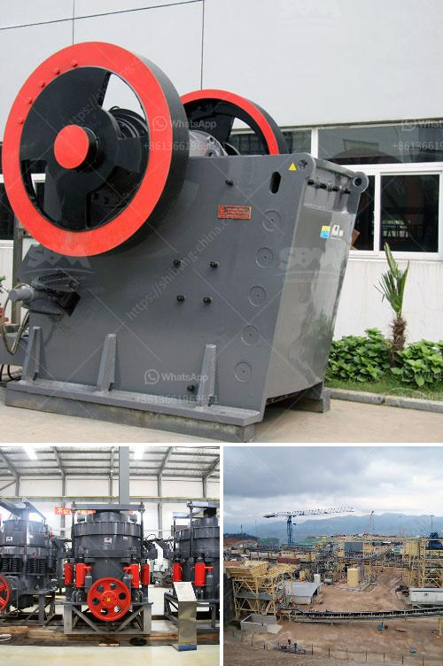

<h3>marbel grinder price in pakistan</h3>
In Pakistan, marble is a commonly used material for both residential and commercial flooring purposes. To achieve a shiny and polished look, marble needs to be ground and smoothened. This is where a marble grinder comes in handy. A marble grinder is a powerful machine that is used to grind and polish marble, thus giving it a glossy appearance.

When it comes to purchasing a marble grinder in Pakistan, there are various factors to consider, such as the machine's power, size, and price. The price range of marble grinders in Pakistan varies depending on the brand, power, and specifications.

In the lower price range (around 100-200 USD), there are smaller marble grinders available. These machines usually have a lesser power range but are suitable for grinding small marble surfaces or for occasional home use. They are compact in size and easy to store. While they may not be as efficient as higher-priced models, they still get the job done.

Moving up the price range (around 200-300 USD), you can find more powerful marble grinders. These machines are ideal for heavy-duty usage, such as large commercial spaces or frequent grinding needs. They come with stronger motors and larger grinding discs, ensuring quicker and more efficient polishing.

It is important to note that the prices mentioned here are approximate and may vary depending on the region and the seller. Additionally, the prices may also fluctuate based on the quality and additional features of the marble grinder.

When purchasing a marble grinder, it is advisable to compare different brands and models, considering their power, durability, and after-sales service. It is also recommended to read reviews and ask for recommendations from experts or previous buyers.

In conclusion, a marble grinder is an essential tool for achieving a polished and lustrous look for marble surfaces. While the price range in Pakistan varies from 100-300 USD, it is crucial to choose a machine that suits the specific requirements and ensures long-term performance. Investing in a reliable marble grinder will help maintain the beauty and longevity of marble surfaces in homes, offices, and commercial spaces.
<h3>Contact us</h3><ul><li><strong>Whatsapp:&nbsp;<a href="https://wa.me/8613661969651">+8613661969651</a></strong></li><li><a href="https://swt.shibang-china.com/?git&amp;zhl&amp;marbel grinder price in pakistan"><strong>Online Service(chat now)</strong></a></li></ul><h3>Related</h3><ul><li><a href='new crushing machine in south africa.md'>new crushing machine in south africa</a></li><li><a href='stone quarry crusher equipment germany.md'>stone quarry crusher equipment germany</a></li><li><a href='screening plant philippines.md'>screening plant philippines</a></li><li><a href='sand making machine indonesia.md'>sand making machine indonesia</a></li><li><a href='machine that crushes stones to ballast.md'>machine that crushes stones to ballast</a></li></ul>