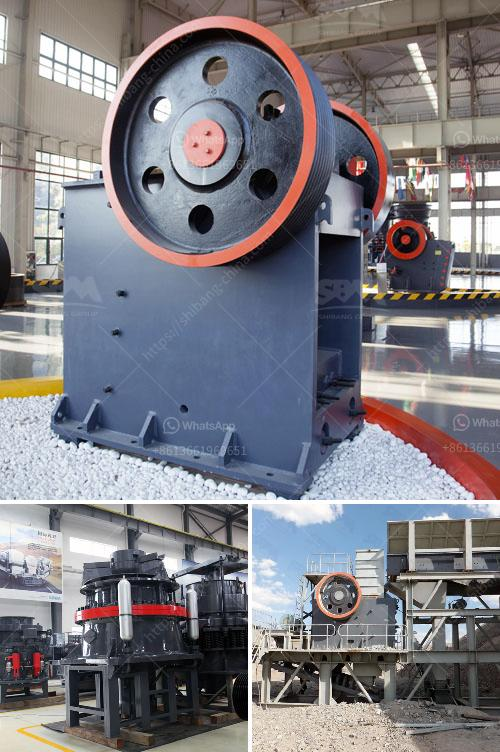

<h3>marbel grinding machine nigeria</h3>
Nigeria's marble deposits are overwhelmingly large and can be found in more than 20 states. With these abundant resources, Nigeria stands as one of the major players in the global marble industry. The country boasts of high-quality marble deposits that can be used for a variety of purposes, including construction, interior decoration, and exportation.

To take full advantage of these marble deposits, Nigeria requires sophisticated machinery for marble grinding. Marble grinding machines are essential equipment in the marble crushing and grinding process. They can be used to grind marble into various forms, which can be further used in diverse industries. The grinding process involves the use of different grit sizes to achieve a smooth finish on marble surfaces.

In Nigeria, there are various types of marble grinding machines available, such as ball mills, vertical roller mills, trapezium mill, and ultrafine mills, among others. These machines offer different grinding techniques for producing the desired quality and fineness of marble powder. They also come with different capacities, depending on the scale of operations.

The marble grinding machine is designed with advanced technology and rugged construction, making it highly efficient and durable. It comes with different features and specifications to meet the various needs of marble grinding in Nigeria. These machines are equipped with powerful motors that ensure smooth and efficient grinding operations. They also include safety features to protect users from accidents during operation.

One popular marble grinding machine in Nigeria is the HGM series ultrafine mill, which is used for finely grinding marble powder. The ultrafine mill has the advantages of high efficiency, low power consumption, small footprint, and low noise. It can produce fine and ultrafine marble powder from 325-2500 mesh.

Another widely used marble grinding machine in Nigeria is the MTW series European trapezium mill, which can achieve a finer grinding effect than the ultrafine mill. It has the advantages of high grinding efficiency, large capacity, and low energy consumption. The trapezium mill is also equipped with advanced dust removal and noise reduction devices, ensuring a clean and quiet working environment.

Marble grinding machines in Nigeria are not only used for grinding marble but also for other stones, such as limestone, quartz, and granite. These machines can also be used for grinding other materials, such as barite, calcite, talc, manganese, and iron ore, which have a high hardness level.

In conclusion, Nigeria's marble grinding machines are essential equipment for marble processing. These machines play a crucial role in grinding marble into various forms for use in construction, interior decoration, and exportation. With the abundance of marble deposits in Nigeria, the demand for marble grinding machines is increasing. Manufacturers are constantly improving their machines to meet the diverse needs of customers. The future of the marble industry in Nigeria looks promising, with the availability of advanced and efficient marble grinding machines.
<h3>Contact us</h3><ul><li><strong>Whatsapp:&nbsp;<a href="https://wa.me/8613661969651">+8613661969651</a></strong></li><li><a href="https://swt.shibang-china.com/?git&amp;zhl&amp;marbel grinding machine nigeria"><strong>Online Service(chat now)</strong></a></li></ul><h3>Related</h3><ul><li><a href='conveyor belt manufacturer in uae.md'>conveyor belt manufacturer in uae</a></li><li><a href='project report for establishing stone crusher.md'>project report for establishing stone crusher</a></li><li><a href='industrial vibrating feeders.md'>industrial vibrating feeders</a></li><li><a href='jaw crusher for sale in south africa.md'>jaw crusher for sale in south africa</a></li><li><a href='ball mills in lima.md'>ball mills in lima</a></li></ul>