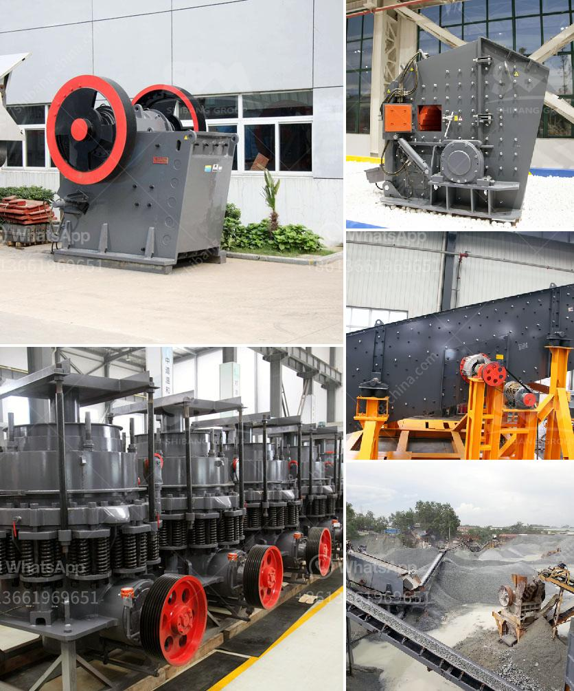

<h3>marble crusher machine philippines</h3>
Marble is a metamorphic rock that is widely used in construction, decoration, and sculpture. It comes in various colors and patterns, making it a popular choice for homeowners and architects. In the Philippines, marble is abundant, especially in the provinces of Romblon, Cebu, and Bulacan. With the increasing demand for marble in the country, there is a need for reliable and efficient marble crusher machines.

A marble crusher machine is essential for the processing of marble stone and the production of marble powder. It mainly consists of a vibrating feeder, a jaw crusher, a sand making machine, a vibrating screen, a conveyor belt, and other equipment. According to the different needs of customers, the output of the required marble size and shape can be configured.

Marble crushers play a very important role in marble stone processing. They can crush the large marble stone into small particles, which allows them to be used in various construction applications. Marble crushers are also used for mining marble stones, which can be used in road construction, building foundations, even in fertilizer production.

In the Philippines, marble crusher machine is a necessary equipment in the construction industry. The future of marble crusher machine in the Philippines market is bright. With the increasing demand for marble, the industry's prospects are optimistic. Among them, the emergence of more and more artificial sand making machine has made the demand for sand and gravel aggregates in the market continue to rise. Therefore, the marble crusher machine needs to be able to meet the requirements of the market and provide customers with high efficiency and low energy consumption equipment.

As a professional crusher machine manufacturer and exporter, AIMIX's crushers have been exported to more than 60 countries over the past 30 years. We have various kinds of crushers for sale, including small concrete crusher for sale, mini crusher for sale, mobile concrete crusher for sale, etc. If you are interested in our products or want to have more detailed information, please feel free to contact us. We will provide you with the best service and product. And we firmly believe that our marble crusher machine will bring great benefits to your mining project in the Philippines.
<h3>Contact us</h3><ul><li><strong>Whatsapp:&nbsp;<a href="https://wa.me/8613661969651">+8613661969651</a></strong></li><li><a href="https://swt.shibang-china.com/?git&amp;zhl&amp;marble crusher machine philippines"><strong>Online Service(chat now)</strong></a></li></ul><h3>Related</h3><ul><li><a href='screening plant philippines.md'>screening plant philippines</a></li><li><a href='crusher machines suppliers in south africa.md'>crusher machines suppliers in south africa</a></li><li><a href='calculations on the capacity of cone crusher.md'>calculations on the capacity of cone crusher</a></li><li><a href='iron crushing equipment.md'>iron crushing equipment</a></li><li><a href='mining procedure in zambia.md'>mining procedure in zambia</a></li></ul>