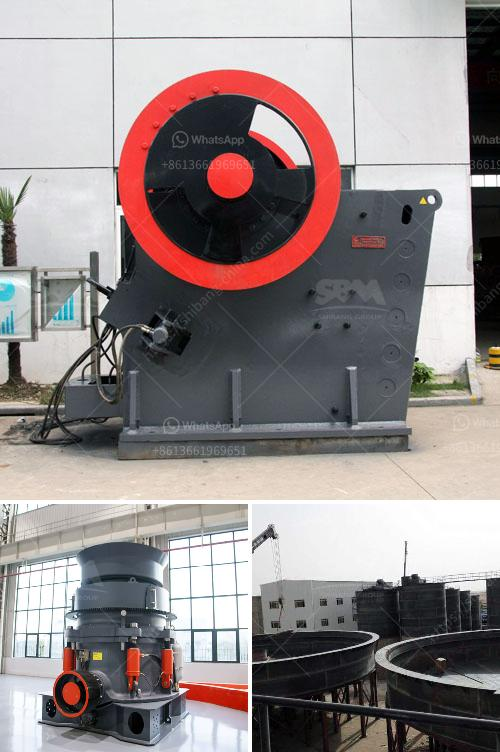

<h3>marble crusher plant in india</h3>
Marble, a natural material, has been used in architecture and design for centuries. With its unique beauty and durability, marble is widely used to create stunning structures and adornments. In India, marble mining is a flourishing industry supplying the vast demand for this timeless stone.

Marble crusher plant is a vital equipment in the mining process. In order to achieve the highest production efficiency, it is crucial to choose reliable, high-quality materials and equipment. To understand the city's entire process, accurately, the crushing process itself provides a high potential for the extraction of minerals from rocks. Presently, India is one of the top countries globally known for its marble production.

India's marble industry has revolutionized in recent years, turning from a small-scale operation to a highly productive and advanced industry. The development of marble crusher plants has allowed marble miners to explore new and rich marble deposits more efficiently. With the advancement of technology and machinery, marble crusher plants are now able to crush and grind marbles into smaller particles, which can be used in a variety of construction and industrial applications.

Marble crusher plants in India have various different types and different types of crushers can be selected according to the specific production requirements of customers. This mainly includes mobile jaw crusher, mobile impact crusher, mobile cone crusher, and hydraulic cone crusher. They are widely used in mining, metallurgy, construction, building materials, highways, railways, water conservancy, and chemical industries, among others.

The establishment of marble crusher plants has provided ample opportunities for various small and medium-sized enterprises and individual marble miners to earn a steady income and contribute to the overall economic growth of India. Moreover, the demand for marble remains strong both domestically and internationally, ensuring a bright future for the marble industry in India.

In conclusion, marble crusher plants in India play a vital role in the mining and processing of marble and ensure its efficient and sustainable extraction. With ever-increasing demands and advancements in technology, India's marble industry is set to expand further, providing employment opportunities and contributing to the nation's economic growth.
<h3>Contact us</h3><ul><li><strong>Whatsapp:&nbsp;<a href="https://wa.me/8613661969651">+8613661969651</a></strong></li><li><a href="https://swt.shibang-china.com/?git&amp;zhl&amp;marble crusher plant in india"><strong>Online Service(chat now)</strong></a></li></ul><h3>Related</h3><ul><li><a href='vertical roller mill animation gif.md'>vertical roller mill animation gif</a></li><li><a href='artificial marble crusher machinery.md'>artificial marble crusher machinery</a></li><li><a href='granite cone crusher.md'>granite cone crusher</a></li><li><a href='complete scm stone crushing plant.md'>complete scm stone crushing plant</a></li><li><a href='grinder machine parts and function.md'>grinder machine parts and function</a></li></ul>