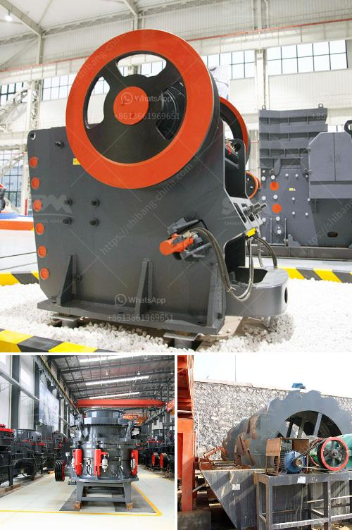

<h3>marble milling machine for sale</h3>
Marble is a highly popular and sought-after material used in various construction and interior design applications. With its elegant appearance and durability, marble adds a touch of sophistication to any space. To work with this precious stone, it is essential to have a reliable and efficient marble milling machine.

A marble milling machine is a cutting tool that is specifically designed for shaping, carving, and milling marble materials. This machine operates by rotating a cylindrical cutting tool with high-speed to remove excess material and create intricate designs or patterns on the marble surface. It is widely used in the construction industry by marble fabricators, architectural firms, and interior designers.

When searching for a marble milling machine for sale, it is vital to consider several factors to ensure you make the right choice. Firstly, you need to assess the machine's size and capacity to handle the marble material you plan to work with. Some machines are suitable for small-scale projects, while others are capable of handling larger pieces of marble. Determining your specific requirements will help you select a machine that meets your production needs.

Additionally, it is crucial to evaluate the machine's performance and efficiency. Look for a milling machine with high-speed capabilities and a powerful motor to ensure smooth and precise operations. The machine should have adjustable speed settings to accommodate different milling needs and provide a clean and uniform finish. Pay attention to the machine's stability and consider models with features like automatic feeding systems and vibration reduction mechanisms for enhanced performance.

The quality and durability of the machine are equally important. Investing in a high-quality milling machine will save you both time and money in the long run. Look for machines made from robust materials that can withstand the demanding nature of marble milling. Research the reputation and track record of the manufacturer to ensure that the machine is built to last and performs consistently.

Furthermore, consider the machine's versatility and compatibility with different design software. Some modern milling machines are compatible with CAD/CAM software, allowing users to create and input intricate designs directly into the machine. This enables precise replication of designs and reduces human error. If you value flexibility and precision, it is advisable to opt for a machine that offers such features.

Lastly, compare prices and warranty options offered by various sellers. While it is essential to stick to your budget, opting for the cheapest machine may not always be the best decision. Consider the overall value, including the machine's quality, performance, and longevity. Look for sellers that offer comprehensive warranties to safeguard your investment.

In conclusion, a marble milling machine is a valuable asset for any professional or business involved in marble fabrication. When searching for a machine for sale, consider the machine's size, capacity, performance, durability, and compatibility with design software. By carefully evaluating these factors, you can make an informed decision and select a milling machine that will enhance your marble fabrication processes and contribute to the success of your projects.
<h3>Contact us</h3><ul><li><strong>Whatsapp:&nbsp;<a href="https://wa.me/8613661969651">+8613661969651</a></strong></li><li><a href="https://swt.shibang-china.com/?git&amp;zhl&amp;marble milling machine for sale"><strong>Online Service(chat now)</strong></a></li></ul><h3>Related</h3><ul><li><a href='how much price of ball mill.md'>how much price of ball mill</a></li><li><a href='used limestone crusher provider in nigeria.md'>used limestone crusher provider in nigeria</a></li><li><a href='operation of stone crusher and screening.md'>operation of stone crusher and screening</a></li><li><a href='strainer of crushing machine.md'>strainer of crushing machine</a></li><li><a href='japan directory of mobile crushing plant.md'>japan directory of mobile crushing plant</a></li></ul>